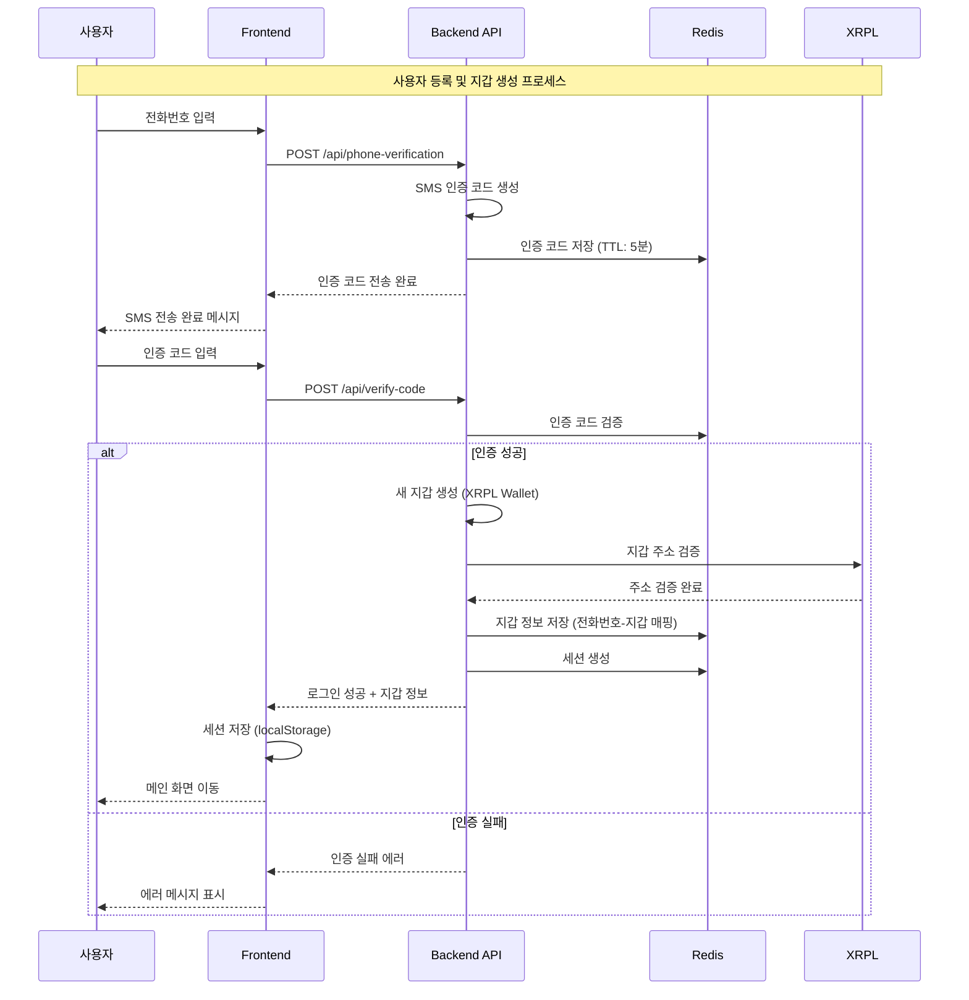
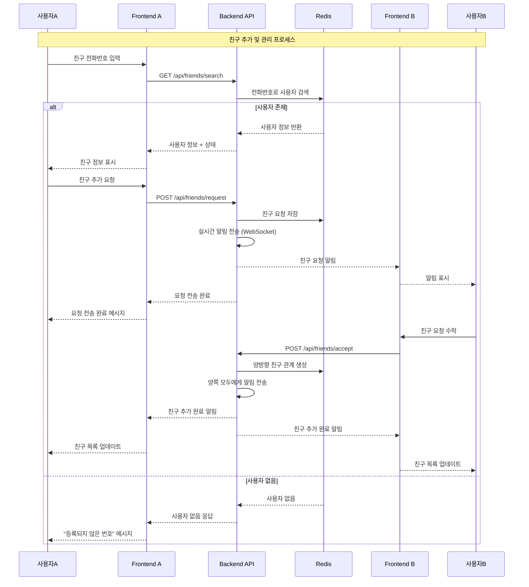
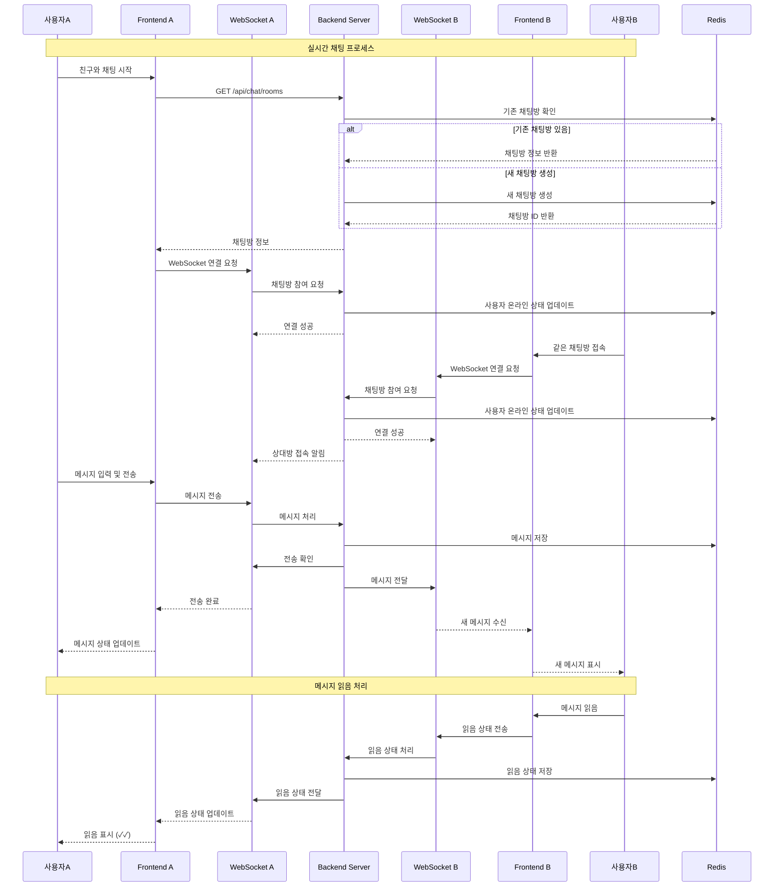
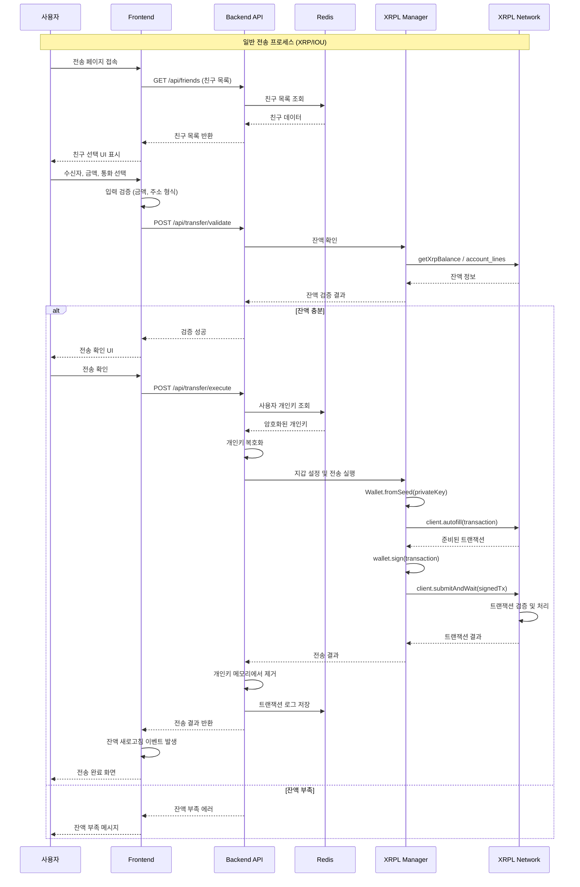
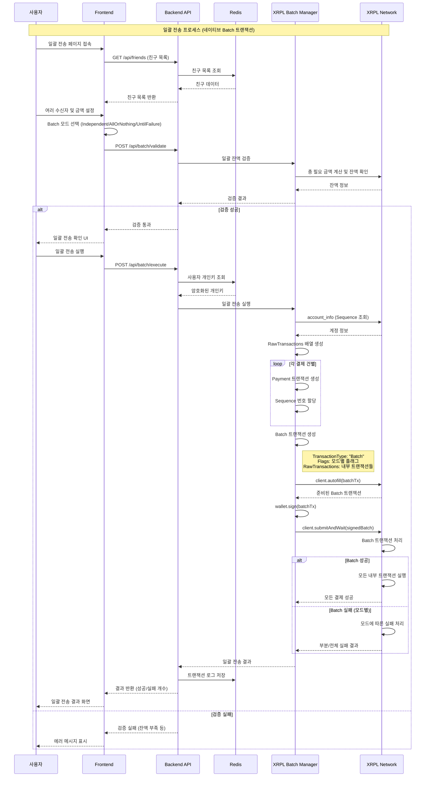
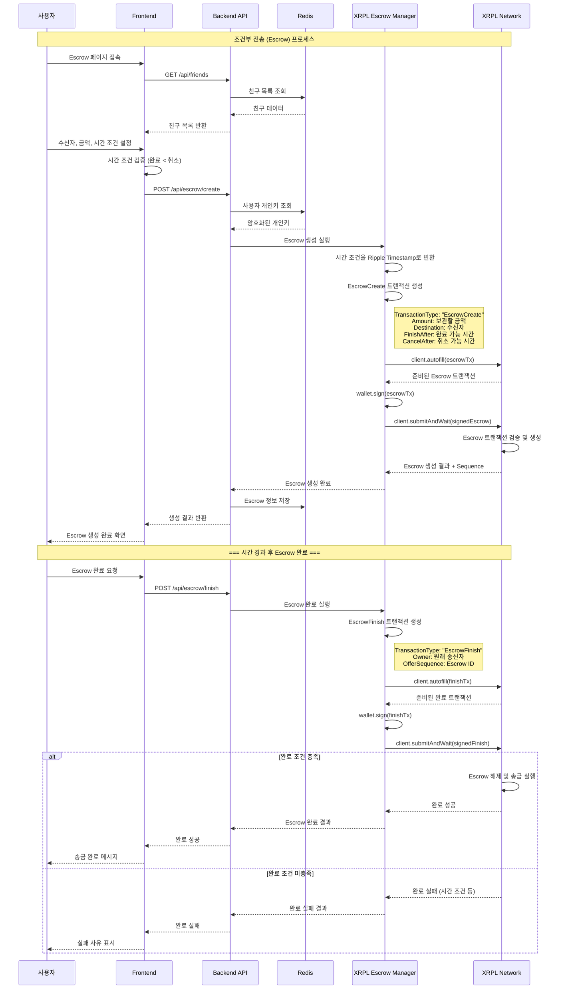
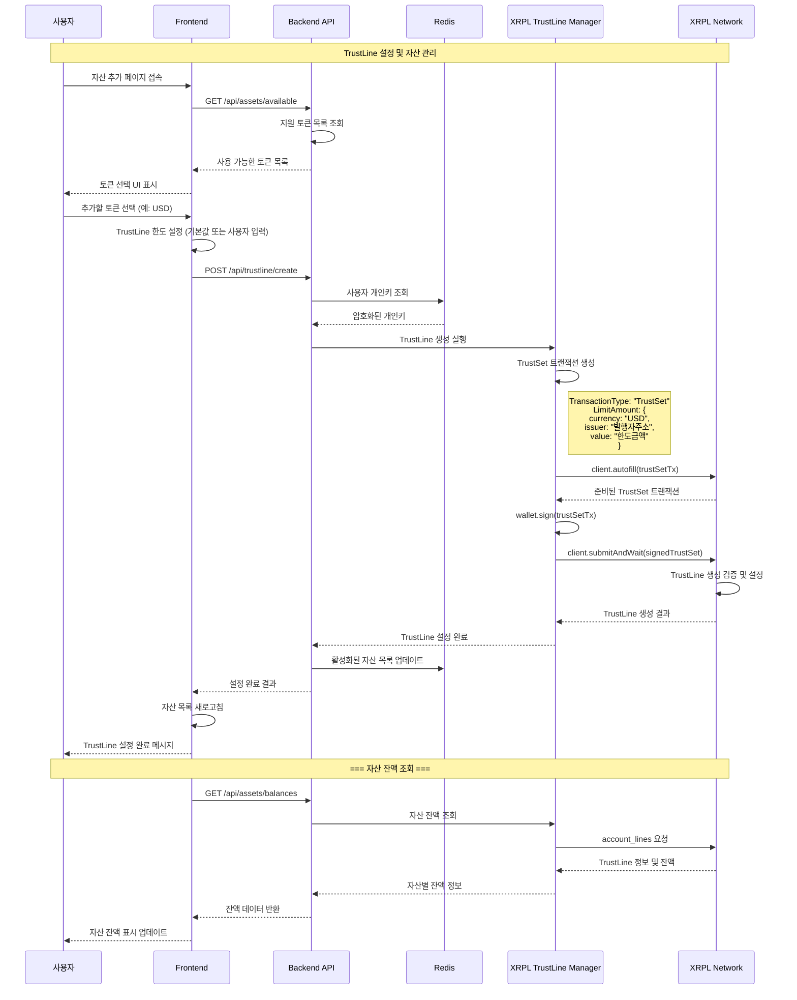
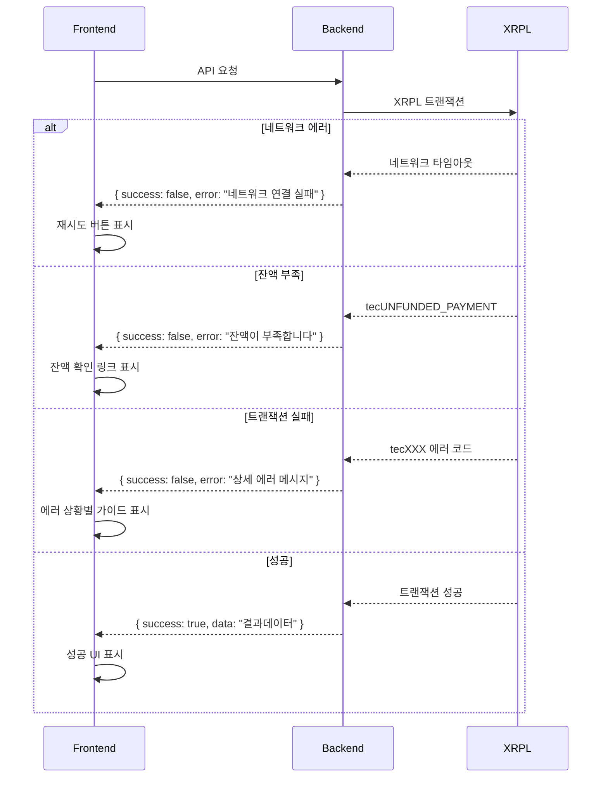

# TalkTalk 시퀀스 다이어그램

> 주요 기능별 상세한 시퀀스 다이어그램을 통한 시스템 흐름 분석

## 📋 목차

1. [사용자 등록 및 지갑 생성](#1-사용자-등록-및-지갑-생성)
2. [친구 추가 및 관리](#2-친구-추가-및-관리)
3. [실시간 채팅](#3-실시간-채팅)
4. [일반 전송 (XRP/IOU)](#4-일반-전송-xrpiou)
5. [일괄 전송 (Batch Payment)](#5-일괄-전송-batch-payment)
6. [조건부 전송 (Escrow)](#6-조건부-전송-escrow)
7. [자산 관리 (TrustLine)](#7-자산-관리-trustline)

---

## 1. 사용자 등록 및 지갑 생성

### 주요 프로세스
1. **전화번호 인증**: SMS 기반 본인 확인
2. **지갑 생성**: XRPL 네이티브 지갑 생성
3. **데이터 저장**: Redis에 암호화된 개인키 저장
4. **세션 관리**: 로그인 상태 유지

---

## 2. 친구 추가 및 관리

### 주요 프로세스
1. **사용자 검색**: 전화번호 기반 사용자 조회
2. **친구 요청**: 비동기 친구 요청 시스템
3. **실시간 알림**: WebSocket을 통한 즉시 알림
4. **양방향 관계**: 상호 친구 관계 생성

---

## 3. 실시간 채팅

### 주요 프로세스
1. **채팅방 관리**: 동적 채팅방 생성 및 관리
2. **WebSocket 연결**: 실시간 양방향 통신
3. **메시지 전달**: 즉시 메시지 전송 및 수신
4. **상태 관리**: 온라인/오프라인, 읽음 상태 관리

---

## 4. 일반 전송 (XRP/IOU)

### 주요 프로세스
1. **사전 검증**: 잔액 및 입력값 검증
2. **보안 처리**: 개인키 안전 처리 (복호화 → 사용 → 즉시 제거)
3. **XRPL 통합**: 표준 XRPL 트랜잭션 패턴
4. **결과 처리**: 성공/실패 결과 처리 및 UI 업데이트

---

## 5. 일괄 전송 (Batch Payment)

### Batch 모드별 처리
- **Independent (0x00080000)**: 각 트랜잭션 독립 실행
- **AllOrNothing (0x00010000)**: 모두 성공 또는 모두 실패
- **UntilFailure (0x00040000)**: 순차 실행, 첫 실패 시 중단

---

## 6. 조건부 전송 (Escrow)

### Escrow 주요 기능
1. **시간 기반 조건**: FinishAfter, CancelAfter 설정
2. **자동 해제**: 조건 충족 시 자동 송금
3. **취소 기능**: 시간 초과 시 원송신자에게 반환
4. **안전 보관**: 중간 상태에서 안전하게 자금 보관

---

## 7. 자산 관리 (TrustLine)

### TrustLine 주요 개념
1. **신뢰선 설정**: 특정 발행자의 토큰을 받을 수 있도록 설정
2. **한도 관리**: 최대 보유 가능한 토큰 양 설정
3. **발행자 검증**: 신뢰할 수 있는 토큰 발행자 확인
4. **잔액 조회**: 설정된 모든 자산의 실시간 잔액 확인

---

## 🔄 공통 에러 처리 패턴

모든 시퀀스에서 공통으로 적용되는 에러 처리:

---

## 📊 성능 최적화 포인트

1. **WebSocket 연결 풀링**: 채팅 연결 재사용
2. **Redis 캐싱**: 친구 목록, 잔액 정보 캐싱
3. **XRPL 연결 관리**: 연결 풀 및 재연결 로직
4. **배치 처리**: 여러 트랜잭션 통합 처리
5. **비동기 처리**: 무거운 작업의 백그라운드 처리

이러한 시퀀스 다이어그램을 통해 TalkTalk의 복잡한 비즈니스 로직과 블록체인 통합 과정을 명확히 이해할 수 있습니다.