# TalkTalk 시스템 흐름 다이어그램 📊

> **시스템의 모든 주요 흐름을 시퀀스 다이어그램으로 시각화**
> 
> 개발자가 시스템을 이해하기 쉽도록 각 기능별 상세 흐름을 다이어그램으로 표현합니다.

---

## 📋 **목차**

1. [전체 시스템 아키텍처 & 데이터 저장 구조](#전체-시스템-아키텍처--데이터-저장-구조)
2. [지갑 생성 흐름](#지갑-생성-흐름)
3. [지갑 복구 흐름](#지갑-복구-흐름)
4. [자산 추가 흐름](#자산-추가-흐름)
5. [친구 추가 흐름](#친구-추가-흐름)
6. [전송 흐름](#전송-흐름)
7. [채팅 흐름](#채팅-흐름)
8. [스왑 흐름](#스왑-흐름)
9. [Trust Line 설정 흐름](#trust-line-설정-흐름)
10. [Faucet 사용 흐름](#faucet-사용-흐름)
11. [실시간 잔액 조회 흐름](#실시간-잔액-조회-흐름)

---

## 🏗️ **전체 시스템 아키텍처 & 데이터 저장 구조**

### 전체 시스템 데이터 저장 아키텍처 (v1.0.2)

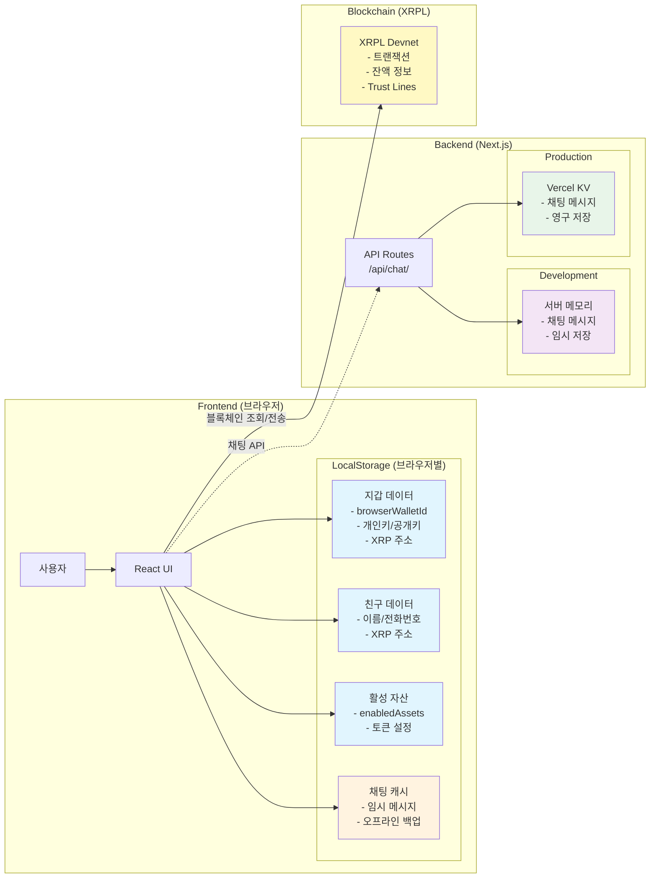
```mermaid
graph LR
    subgraph "Frontend (브라우저)"
        U[사용자]
        UI[React UI]

        subgraph "LocalStorage (브라우저별)"
            LSW[지갑 데이터<br/>- browserWalletId<br/>- 개인키/공개키<br/>- XRP 주소]
            LSF[친구 데이터<br/>- 이름/전화번호<br/>- XRP 주소]
            LSA[활성 자산<br/>- enabledAssets<br/>- 토큰 설정]
            LSC[채팅 캐시<br/>- 임시 메시지<br/>- 오프라인 백업]
        end
    end

    subgraph "Backend (Next.js)"
        API[API Routes<br/>/api/chat/]

        subgraph "Development"
            MEM[서버 메모리<br/>- 채팅 메시지<br/>- 임시 저장]
        end

        subgraph "Production"
            KV[Vercel KV<br/>- 채팅 메시지<br/>- 영구 저장]
        end
    end

    subgraph "Blockchain (XRPL)"
        XN[XRPL Devnet<br/>- 트랜잭션<br/>- 잔액 정보<br/>- Trust Lines]
    end

    U --> UI
    UI --> LSW
    UI --> LSF
    UI --> LSA
    UI --> LSC

    UI -.->|채팅 API| API
    API --> MEM
    API --> KV

    UI -->|블록체인 조회/전송| XN

    style LSW fill:#e1f5fe
    style LSF fill:#e1f5fe
    style LSA fill:#e1f5fe
    style LSC fill:#fff3e0
    style MEM fill:#f3e5f5
    style KV fill:#e8f5e9
    style XN fill:#fff9c4
```

### 데이터 저장 위치 매트릭스

| 데이터 종류 | LocalStorage | Server Memory | Vercel KV | XRPL Network | 설명 |
|-------------|--------------|---------------|-----------|--------------|------|
| **지갑 정보** | ✅ | ❌ | ❌ | ❌ | 브라우저별 개인키/주소 |
| **친구 목록** | ✅ | ❌ | ❌ | ❌ | 전화번호/이름/주소 |
| **활성 자산** | ✅ | ❌ | ❌ | ❌ | 사용자 토큰 설정 |
| **채팅 메시지** | 🔄 (캐시) | ✅ (Dev) | ✅ (Prod) | ❌ | 서버 기반 실시간 |
| **트랜잭션** | ❌ | ❌ | ❌ | ✅ | 블록체인 영구 저장 |
| **잔액 정보** | ❌ | ❌ | ❌ | ✅ | 실시간 블록체인 조회 |
| **Trust Lines** | ❌ | ❌ | ❌ | ✅ | XRPL 네트워크 설정 |

### 브라우저별 독립 지갑 시스템

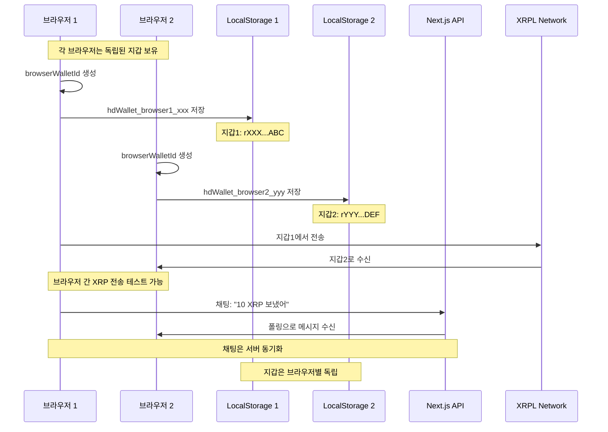
```mermaid
sequenceDiagram
    participant B1 as 브라우저 1
    participant B2 as 브라우저 2
    participant LS1 as LocalStorage 1
    participant LS2 as LocalStorage 2
    participant API as Next.js API
    participant XN as XRPL Network

    Note over B1,B2: 각 브라우저는 독립된 지갑 보유

    B1->>B1: browserWalletId 생성
    B1->>LS1: hdWallet_browser1_xxx 저장
    Note over LS1: 지갑1: rXXX...ABC

    B2->>B2: browserWalletId 생성
    B2->>LS2: hdWallet_browser2_yyy 저장
    Note over LS2: 지갑2: rYYY...DEF

    B1->>XN: 지갑1에서 전송
    XN->>B2: 지갑2로 수신

    Note over B1,B2: 브라우저 간 XRP 전송 테스트 가능

    B1->>API: 채팅: "10 XRP 보냈어"
    API->>B2: 폴링으로 메시지 수신

    Note over B1,API: 채팅은 서버 동기화
    Note over LS1,LS2: 지갑은 브라우저별 독립
```

---

## 💼 **지갑 생성 흐름**

### 기본 지갑 생성

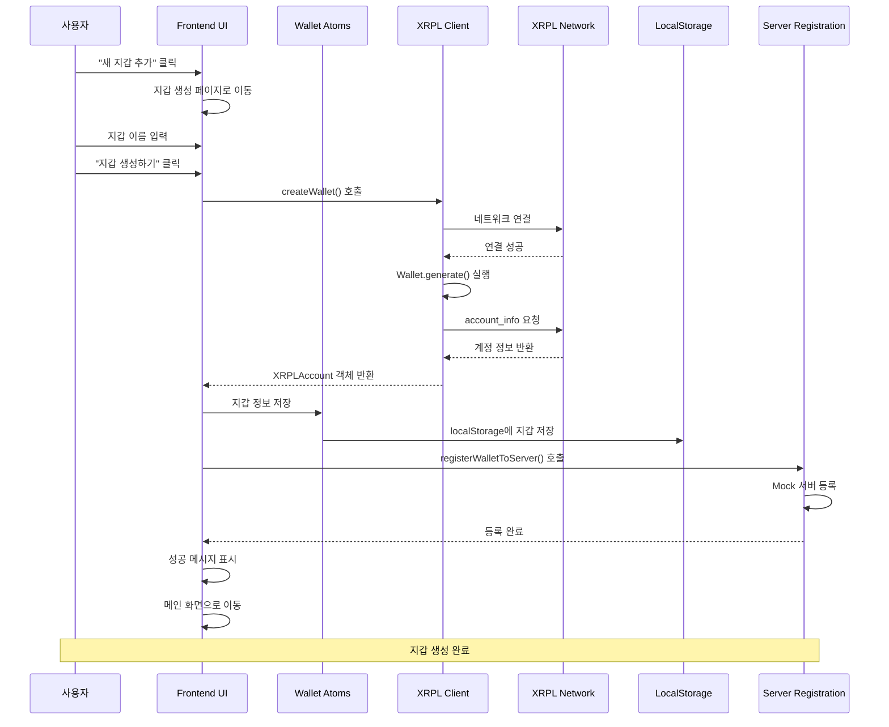
```mermaid
sequenceDiagram
    participant U as 사용자
    participant UI as Frontend UI
    participant WA as Wallet Atoms
    participant XC as XRPL Client
    participant XN as XRPL Network
    participant LS as LocalStorage
    participant SR as Server Registration

    U->>UI: "새 지갑 추가" 클릭
    UI->>UI: 지갑 생성 페이지로 이동
    
    U->>UI: 지갑 이름 입력
    U->>UI: "지갑 생성하기" 클릭
    
    UI->>XC: createWallet() 호출
    XC->>XN: 네트워크 연결
    XN-->>XC: 연결 성공
    
    XC->>XC: Wallet.generate() 실행
    XC->>XN: account_info 요청
    XN-->>XC: 계정 정보 반환
    
    XC-->>UI: XRPLAccount 객체 반환
    UI->>WA: 지갑 정보 저장
    WA->>LS: localStorage에 지갑 저장
    
    UI->>SR: registerWalletToServer() 호출
    SR->>SR: Mock 서버 등록
    SR-->>UI: 등록 완료
    
    UI->>UI: 성공 메시지 표시
    UI->>UI: 메인 화면으로 이동
    
    Note over U,SR: 지갑 생성 완료
```

### HD 지갑 생성 (다중 자산)

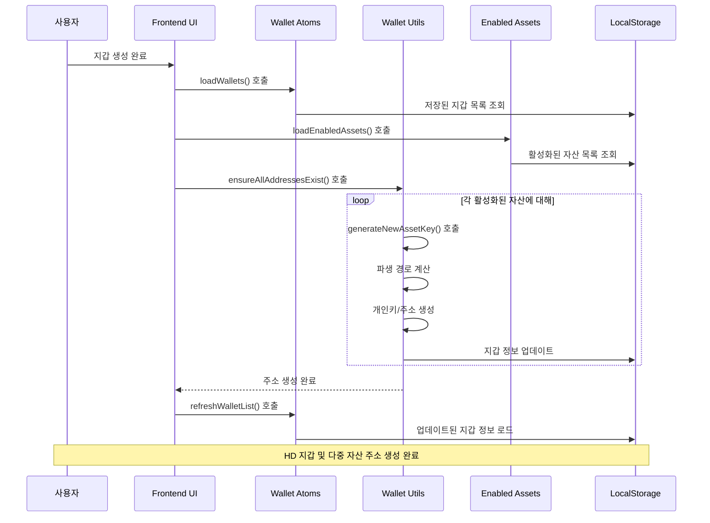
```mermaid
sequenceDiagram
    participant U as 사용자
    participant UI as Frontend UI
    participant WA as Wallet Atoms
    participant WU as Wallet Utils
    participant EA as Enabled Assets
    participant LS as LocalStorage

    U->>UI: 지갑 생성 완료
    UI->>WA: loadWallets() 호출
    WA->>LS: 저장된 지갑 목록 조회
    
    UI->>EA: loadEnabledAssets() 호출
    EA->>LS: 활성화된 자산 목록 조회
    
    UI->>WU: ensureAllAddressesExist() 호출
    
    loop 각 활성화된 자산에 대해
        WU->>WU: generateNewAssetKey() 호출
        WU->>WU: 파생 경로 계산
        WU->>WU: 개인키/주소 생성
        WU->>LS: 지갑 정보 업데이트
    end
    
    WU-->>UI: 주소 생성 완료
    UI->>WA: refreshWalletList() 호출
    WA->>LS: 업데이트된 지갑 정보 로드
    
    Note over U,LS: HD 지갑 및 다중 자산 주소 생성 완료
```

---

## 🔄 **지갑 복구 흐름**

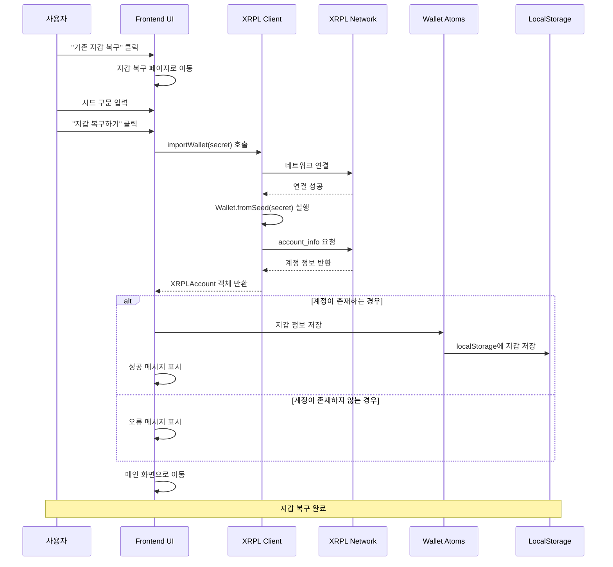
```mermaid
sequenceDiagram
    participant U as 사용자
    participant UI as Frontend UI
    participant XC as XRPL Client
    participant XN as XRPL Network
    participant WA as Wallet Atoms
    participant LS as LocalStorage

    U->>UI: "기존 지갑 복구" 클릭
    UI->>UI: 지갑 복구 페이지로 이동
    
    U->>UI: 시드 구문 입력
    U->>UI: "지갑 복구하기" 클릭
    
    UI->>XC: importWallet(secret) 호출
    XC->>XN: 네트워크 연결
    XN-->>XC: 연결 성공
    
    XC->>XC: Wallet.fromSeed(secret) 실행
    XC->>XN: account_info 요청
    XN-->>XC: 계정 정보 반환
    
    XC-->>UI: XRPLAccount 객체 반환
    
    alt 계정이 존재하는 경우
        UI->>WA: 지갑 정보 저장
        WA->>LS: localStorage에 지갑 저장
        UI->>UI: 성공 메시지 표시
    else 계정이 존재하지 않는 경우
        UI->>UI: 오류 메시지 표시
    end
    
    UI->>UI: 메인 화면으로 이동
    
    Note over U,LS: 지갑 복구 완료
```

---

## 💰 **자산 추가 흐름**

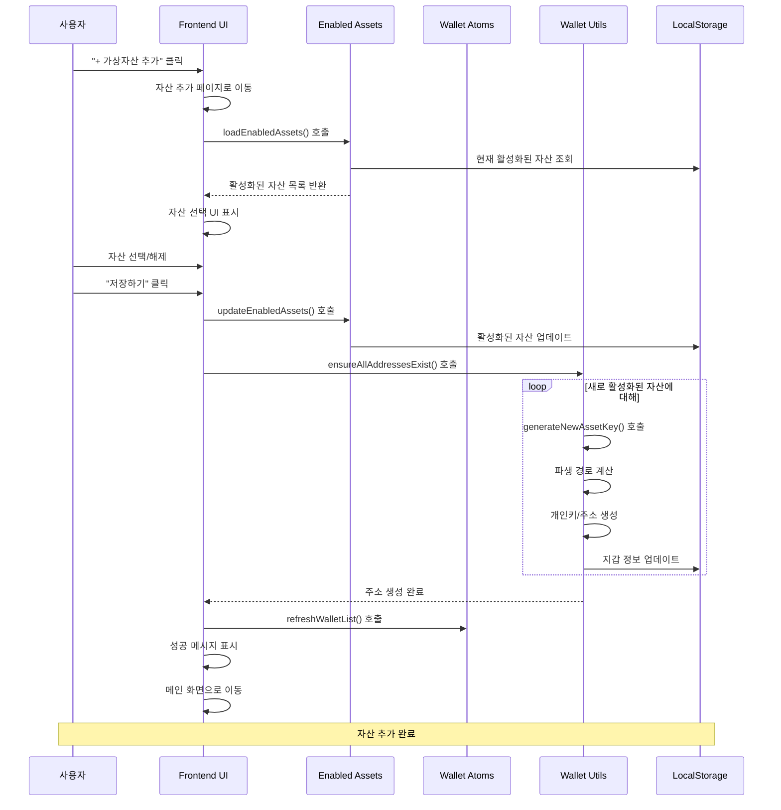
```mermaid
sequenceDiagram
    participant U as 사용자
    participant UI as Frontend UI
    participant EA as Enabled Assets
    participant WA as Wallet Atoms
    participant WU as Wallet Utils
    participant LS as LocalStorage

    U->>UI: "+ 가상자산 추가" 클릭
    UI->>UI: 자산 추가 페이지로 이동
    
    UI->>EA: loadEnabledAssets() 호출
    EA->>LS: 현재 활성화된 자산 조회
    EA-->>UI: 활성화된 자산 목록 반환
    
    UI->>UI: 자산 선택 UI 표시
    
    U->>UI: 자산 선택/해제
    U->>UI: "저장하기" 클릭
    
    UI->>EA: updateEnabledAssets() 호출
    EA->>LS: 활성화된 자산 업데이트
    
    UI->>WU: ensureAllAddressesExist() 호출
    
    loop 새로 활성화된 자산에 대해
        WU->>WU: generateNewAssetKey() 호출
        WU->>WU: 파생 경로 계산
        WU->>WU: 개인키/주소 생성
        WU->>LS: 지갑 정보 업데이트
    end
    
    WU-->>UI: 주소 생성 완료
    UI->>WA: refreshWalletList() 호출
    UI->>UI: 성공 메시지 표시
    UI->>UI: 메인 화면으로 이동
    
    Note over U,LS: 자산 추가 완료
```

---

## 👥 **친구 추가 흐름**

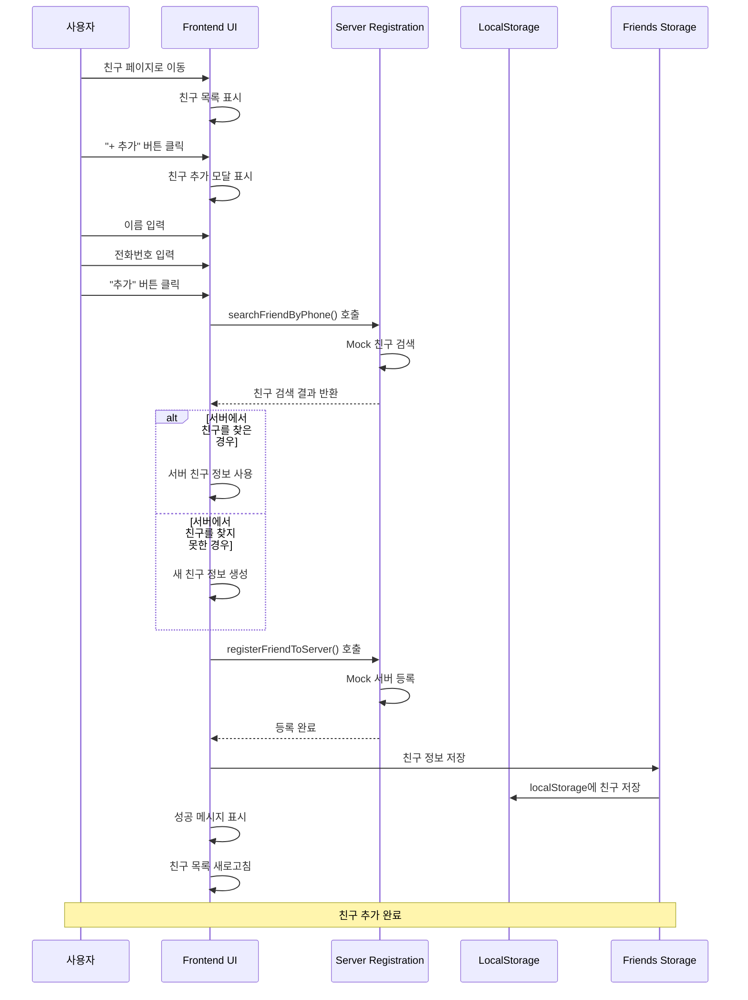
```mermaid
sequenceDiagram
    participant U as 사용자
    participant UI as Frontend UI
    participant SR as Server Registration
    participant LS as LocalStorage
    participant FS as Friends Storage

    U->>UI: 친구 페이지로 이동
    UI->>UI: 친구 목록 표시
    
    U->>UI: "+ 추가" 버튼 클릭
    UI->>UI: 친구 추가 모달 표시
    
    U->>UI: 이름 입력
    U->>UI: 전화번호 입력
    U->>UI: "추가" 버튼 클릭
    
    UI->>SR: searchFriendByPhone() 호출
    SR->>SR: Mock 친구 검색
    SR-->>UI: 친구 검색 결과 반환
    
    alt 서버에서 친구를 찾은 경우
        UI->>UI: 서버 친구 정보 사용
    else 서버에서 친구를 찾지 못한 경우
        UI->>UI: 새 친구 정보 생성
    end
    
    UI->>SR: registerFriendToServer() 호출
    SR->>SR: Mock 서버 등록
    SR-->>UI: 등록 완료
    
    UI->>FS: 친구 정보 저장
    FS->>LS: localStorage에 친구 저장
    
    UI->>UI: 성공 메시지 표시
    UI->>UI: 친구 목록 새로고침
    
    Note over U,FS: 친구 추가 완료
```

---

## 💸 **전송 흐름**

### 기본 전송 흐름

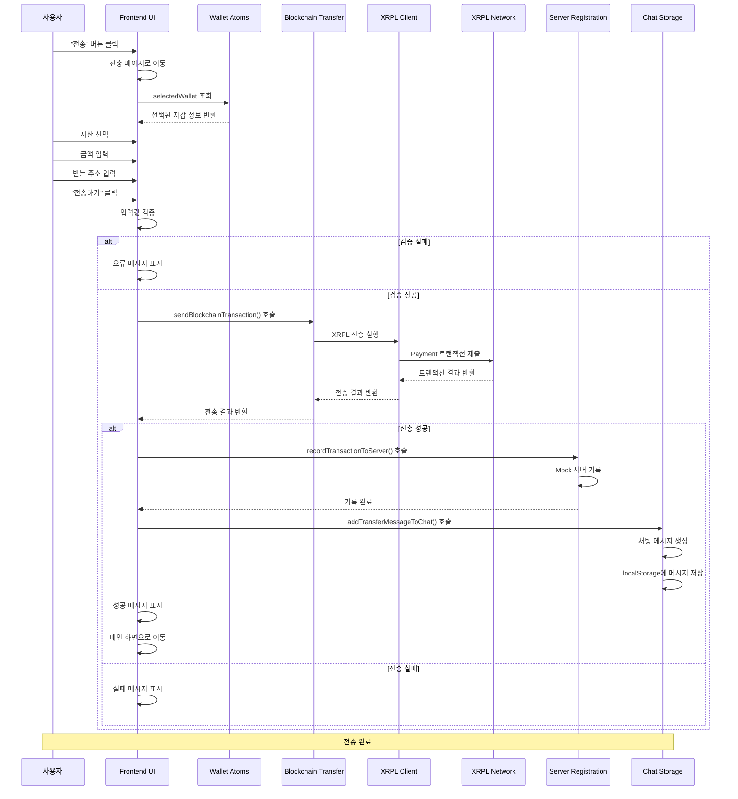
```mermaid
sequenceDiagram
    participant U as 사용자
    participant UI as Frontend UI
    participant WA as Wallet Atoms
    participant BT as Blockchain Transfer
    participant XC as XRPL Client
    participant XN as XRPL Network
    participant SR as Server Registration
    participant CS as Chat Storage

    U->>UI: "전송" 버튼 클릭
    UI->>UI: 전송 페이지로 이동
    
    UI->>WA: selectedWallet 조회
    WA-->>UI: 선택된 지갑 정보 반환
    
    U->>UI: 자산 선택
    U->>UI: 금액 입력
    U->>UI: 받는 주소 입력
    U->>UI: "전송하기" 클릭
    
    UI->>UI: 입력값 검증
    
    alt 검증 실패
        UI->>UI: 오류 메시지 표시
    else 검증 성공
        UI->>BT: sendBlockchainTransaction() 호출
        BT->>XC: XRPL 전송 실행
        XC->>XN: Payment 트랜잭션 제출
        XN-->>XC: 트랜잭션 결과 반환
        XC-->>BT: 전송 결과 반환
        BT-->>UI: 전송 결과 반환
        
        alt 전송 성공
            UI->>SR: recordTransactionToServer() 호출
            SR->>SR: Mock 서버 기록
            SR-->>UI: 기록 완료
            
            UI->>CS: addTransferMessageToChat() 호출
            CS->>CS: 채팅 메시지 생성
            CS->>CS: localStorage에 메시지 저장
            
            UI->>UI: 성공 메시지 표시
            UI->>UI: 메인 화면으로 이동
        else 전송 실패
            UI->>UI: 실패 메시지 표시
        end
    end
    
    Note over U,CS: 전송 완료
```

### 친구에게 전송 흐름

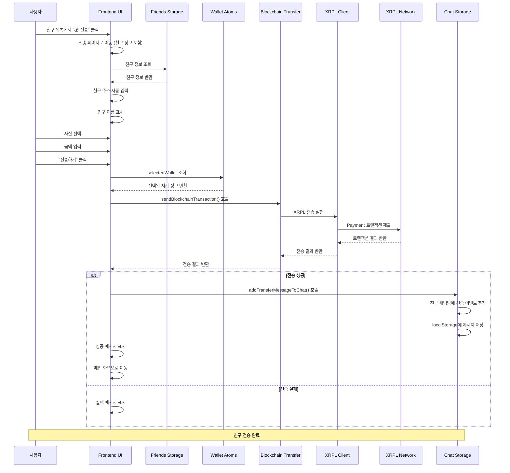
```mermaid
sequenceDiagram
    participant U as 사용자
    participant UI as Frontend UI
    participant FS as Friends Storage
    participant WA as Wallet Atoms
    participant BT as Blockchain Transfer
    participant XC as XRPL Client
    participant XN as XRPL Network
    participant CS as Chat Storage

    U->>UI: 친구 목록에서 "💰 전송" 클릭
    UI->>UI: 전송 페이지로 이동 (친구 정보 포함)
    
    UI->>FS: 친구 정보 조회
    FS-->>UI: 친구 정보 반환
    
    UI->>UI: 친구 주소 자동 입력
    UI->>UI: 친구 이름 표시
    
    U->>UI: 자산 선택
    U->>UI: 금액 입력
    U->>UI: "전송하기" 클릭
    
    UI->>WA: selectedWallet 조회
    WA-->>UI: 선택된 지갑 정보 반환
    
    UI->>BT: sendBlockchainTransaction() 호출
    BT->>XC: XRPL 전송 실행
    XC->>XN: Payment 트랜잭션 제출
    XN-->>XC: 트랜잭션 결과 반환
    XC-->>BT: 전송 결과 반환
    BT-->>UI: 전송 결과 반환
    
    alt 전송 성공
        UI->>CS: addTransferMessageToChat() 호출
        CS->>CS: 친구 채팅방에 전송 이벤트 추가
        CS->>CS: localStorage에 메시지 저장
        
        UI->>UI: 성공 메시지 표시
        UI->>UI: 메인 화면으로 이동
    else 전송 실패
        UI->>UI: 실패 메시지 표시
    end
    
    Note over U,CS: 친구 전송 완료
```

---

## 📦 **일괄 전송 흐름**

### Batch Payment 전체 흐름

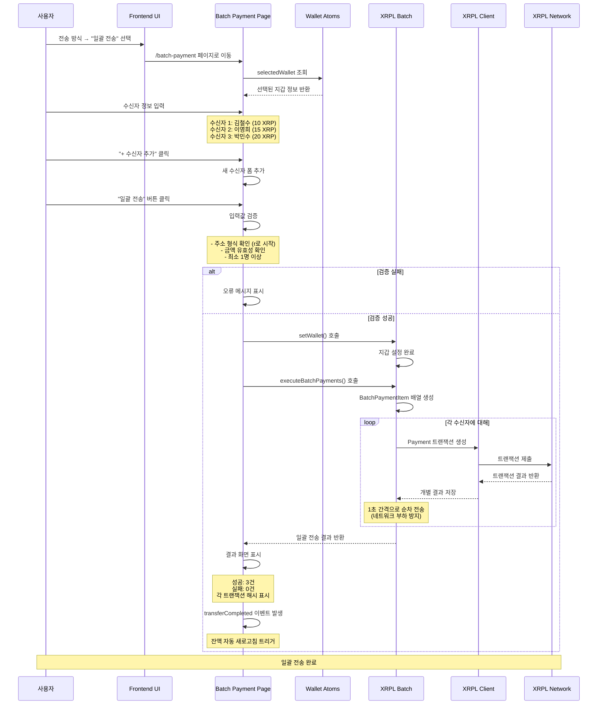
```mermaid
sequenceDiagram
    participant U as 사용자
    participant UI as Frontend UI
    participant BP as Batch Payment Page
    participant WA as Wallet Atoms
    participant XB as XRPL Batch
    participant XC as XRPL Client
    participant XN as XRPL Network

    U->>UI: 전송 방식 → "일괄 전송" 선택
    UI->>BP: /batch-payment 페이지로 이동

    BP->>WA: selectedWallet 조회
    WA-->>BP: 선택된 지갑 정보 반환

    U->>BP: 수신자 정보 입력
    Note over BP: 수신자 1: 김철수 (10 XRP)<br/>수신자 2: 이영희 (15 XRP)<br/>수신자 3: 박민수 (20 XRP)

    U->>BP: "+ 수신자 추가" 클릭
    BP->>BP: 새 수신자 폼 추가

    U->>BP: "일괄 전송" 버튼 클릭

    BP->>BP: 입력값 검증
    Note over BP: - 주소 형식 확인 (r로 시작)<br/>- 금액 유효성 확인<br/>- 최소 1명 이상

    alt 검증 실패
        BP->>BP: 오류 메시지 표시
    else 검증 성공
        BP->>XB: setWallet() 호출
        XB->>XB: 지갑 설정 완료

        BP->>XB: executeBatchPayments() 호출
        XB->>XB: BatchPaymentItem 배열 생성

        loop 각 수신자에 대해
            XB->>XC: Payment 트랜잭션 생성
            XC->>XN: 트랜잭션 제출
            XN-->>XC: 트랜잭션 결과 반환
            XC-->>XB: 개별 결과 저장

            Note over XB: 1초 간격으로 순차 전송<br/>(네트워크 부하 방지)
        end

        XB-->>BP: 일괄 전송 결과 반환

        BP->>BP: 결과 화면 표시
        Note over BP: 성공: 3건<br/>실패: 0건<br/>각 트랜잭션 해시 표시

        BP->>BP: transferCompleted 이벤트 발생
        Note over BP: 잔액 자동 새로고침 트리거
    end

    Note over U,XN: 일괄 전송 완료
```

### 일괄 전송 결과 처리 흐름

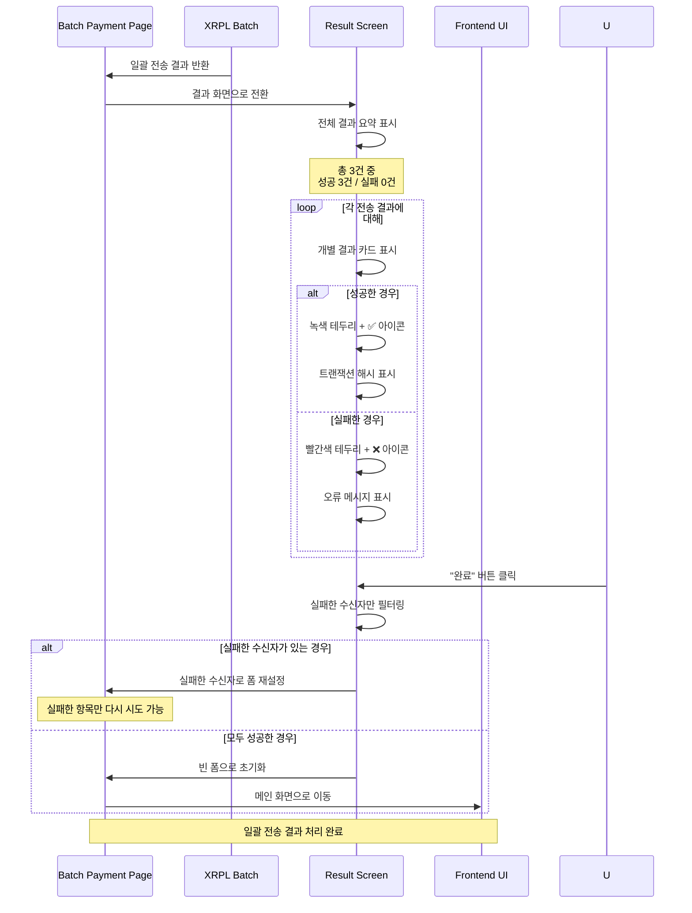
```mermaid
sequenceDiagram
    participant BP as Batch Payment Page
    participant XB as XRPL Batch
    participant RS as Result Screen
    participant UI as Frontend UI

    XB->>BP: 일괄 전송 결과 반환

    BP->>RS: 결과 화면으로 전환

    RS->>RS: 전체 결과 요약 표시
    Note over RS: 총 3건 중<br/>성공 3건 / 실패 0건

    loop 각 전송 결과에 대해
        RS->>RS: 개별 결과 카드 표시

        alt 성공한 경우
            RS->>RS: 녹색 테두리 + ✅ 아이콘
            RS->>RS: 트랜잭션 해시 표시
        else 실패한 경우
            RS->>RS: 빨간색 테두리 + ❌ 아이콘
            RS->>RS: 오류 메시지 표시
        end
    end

    U->>RS: "완료" 버튼 클릭

    RS->>RS: 실패한 수신자만 필터링

    alt 실패한 수신자가 있는 경우
        RS->>BP: 실패한 수신자로 폼 재설정
        Note over BP: 실패한 항목만 다시 시도 가능
    else 모두 성공한 경우
        RS->>BP: 빈 폼으로 초기화
        BP->>UI: 메인 화면으로 이동
    end

    Note over BP,UI: 일괄 전송 결과 처리 완료
```

---

## ⏰ **조건부 송금 흐름**

### Escrow Payment 전체 흐름

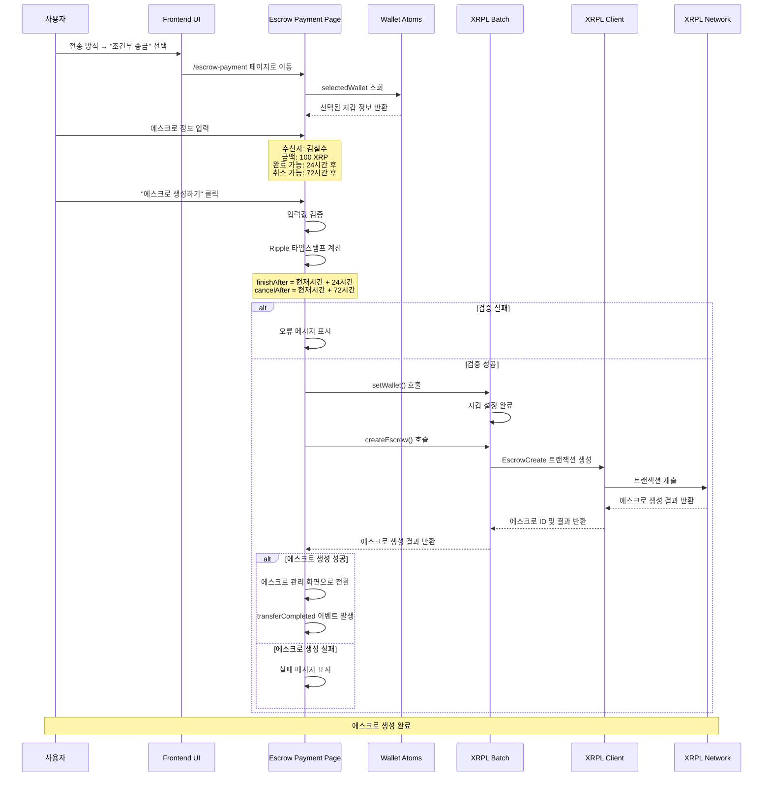
```mermaid
sequenceDiagram
    participant U as 사용자
    participant UI as Frontend UI
    participant EP as Escrow Payment Page
    participant WA as Wallet Atoms
    participant XB as XRPL Batch
    participant XC as XRPL Client
    participant XN as XRPL Network

    U->>UI: 전송 방식 → "조건부 송금" 선택
    UI->>EP: /escrow-payment 페이지로 이동

    EP->>WA: selectedWallet 조회
    WA-->>EP: 선택된 지갑 정보 반환

    U->>EP: 에스크로 정보 입력
    Note over EP: 수신자: 김철수<br/>금액: 100 XRP<br/>완료 가능: 24시간 후<br/>취소 가능: 72시간 후

    U->>EP: "에스크로 생성하기" 클릭

    EP->>EP: 입력값 검증
    EP->>EP: Ripple 타임스탬프 계산
    Note over EP: finishAfter = 현재시간 + 24시간<br/>cancelAfter = 현재시간 + 72시간

    alt 검증 실패
        EP->>EP: 오류 메시지 표시
    else 검증 성공
        EP->>XB: setWallet() 호출
        XB->>XB: 지갑 설정 완료

        EP->>XB: createEscrow() 호출
        XB->>XC: EscrowCreate 트랜잭션 생성
        XC->>XN: 트랜잭션 제출
        XN-->>XC: 에스크로 생성 결과 반환
        XC-->>XB: 에스크로 ID 및 결과 반환
        XB-->>EP: 에스크로 생성 결과 반환

        alt 에스크로 생성 성공
            EP->>EP: 에스크로 관리 화면으로 전환
            EP->>EP: transferCompleted 이벤트 발생
        else 에스크로 생성 실패
            EP->>EP: 실패 메시지 표시
        end
    end

    Note over U,XN: 에스크로 생성 완료
```

### 에스크로 관리 흐름

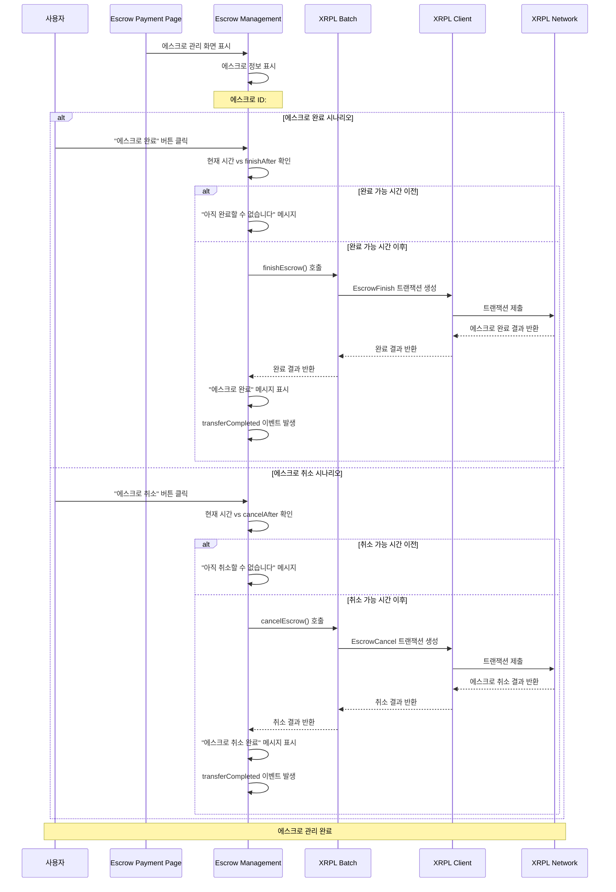
```mermaid
sequenceDiagram
    participant U as 사용자
    participant EP as Escrow Payment Page
    participant EM as Escrow Management
    participant XB as XRPL Batch
    participant XC as XRPL Client
    participant XN as XRPL Network

    EP->>EM: 에스크로 관리 화면 표시

    EM->>EM: 에스크로 정보 표시
    Note over EM: 에스크로 ID: #abc123<br/>수신자: 김철수<br/>금액: 100 XRP<br/>상태: 대기 중 ⏳<br/>완료 가능: 2025-01-22 15:30<br/>취소 가능: 2025-01-24 15:30

    alt 에스크로 완료 시나리오
        U->>EM: "에스크로 완료" 버튼 클릭

        EM->>EM: 현재 시간 vs finishAfter 확인

        alt 완료 가능 시간 이전
            EM->>EM: "아직 완료할 수 없습니다" 메시지
        else 완료 가능 시간 이후
            EM->>XB: finishEscrow() 호출
            XB->>XC: EscrowFinish 트랜잭션 생성
            XC->>XN: 트랜잭션 제출
            XN-->>XC: 에스크로 완료 결과 반환
            XC-->>XB: 완료 결과 반환
            XB-->>EM: 완료 결과 반환

            EM->>EM: "에스크로 완료" 메시지 표시
            EM->>EM: transferCompleted 이벤트 발생
        end

    else 에스크로 취소 시나리오
        U->>EM: "에스크로 취소" 버튼 클릭

        EM->>EM: 현재 시간 vs cancelAfter 확인

        alt 취소 가능 시간 이전
            EM->>EM: "아직 취소할 수 없습니다" 메시지
        else 취소 가능 시간 이후
            EM->>XB: cancelEscrow() 호출
            XB->>XC: EscrowCancel 트랜잭션 생성
            XC->>XN: 트랜잭션 제출
            XN-->>XC: 에스크로 취소 결과 반환
            XC-->>XB: 취소 결과 반환
            XB-->>EM: 취소 결과 반환

            EM->>EM: "에스크로 취소 완료" 메시지 표시
            EM->>EM: transferCompleted 이벤트 발생
        end
    end

    Note over U,XN: 에스크로 관리 완료
```

### 에스크로 사용 시나리오 흐름

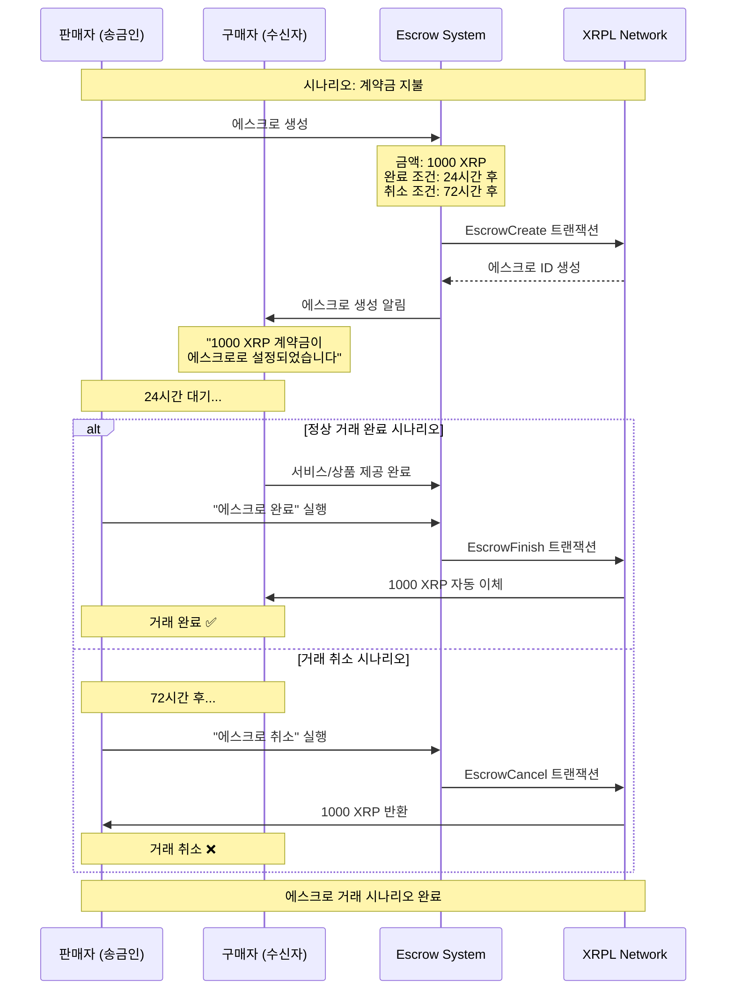
```mermaid
sequenceDiagram
    participant S as 판매자 (송금인)
    participant B as 구매자 (수신자)
    participant ES as Escrow System
    participant XN as XRPL Network

    Note over S,XN: 시나리오: 계약금 지불

    S->>ES: 에스크로 생성
    Note over ES: 금액: 1000 XRP<br/>완료 조건: 24시간 후<br/>취소 조건: 72시간 후

    ES->>XN: EscrowCreate 트랜잭션
    XN-->>ES: 에스크로 ID 생성

    ES->>B: 에스크로 생성 알림
    Note over B: "1000 XRP 계약금이<br/>에스크로로 설정되었습니다"

    Note over S,B: 24시간 대기...

    alt 정상 거래 완료 시나리오
        B->>ES: 서비스/상품 제공 완료
        S->>ES: "에스크로 완료" 실행
        ES->>XN: EscrowFinish 트랜잭션
        XN->>B: 1000 XRP 자동 이체

        Note over S,B: 거래 완료 ✅

    else 거래 취소 시나리오
        Note over S,B: 72시간 후...

        S->>ES: "에스크로 취소" 실행
        ES->>XN: EscrowCancel 트랜잭션
        XN->>S: 1000 XRP 반환

        Note over S,B: 거래 취소 ❌
    end

    Note over S,XN: 에스크로 거래 시나리오 완료
```

---

## 💬 **채팅 흐름**

### 서버 기반 채팅방 입장 흐름 (v1.0.2)

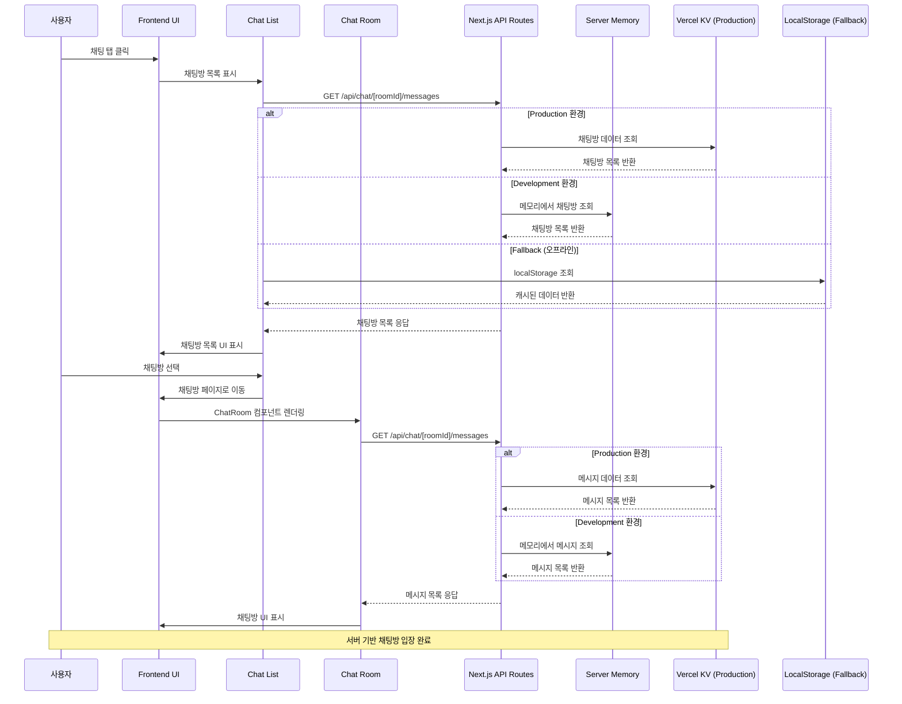
```mermaid
sequenceDiagram
    participant U as 사용자
    participant UI as Frontend UI
    participant CL as Chat List
    participant CR as Chat Room
    participant API as Next.js API Routes
    participant MEM as Server Memory
    participant KV as Vercel KV (Production)
    participant LS as LocalStorage (Fallback)

    U->>UI: 채팅 탭 클릭
    UI->>CL: 채팅방 목록 표시

    CL->>API: GET /api/chat/[roomId]/messages

    alt Production 환경
        API->>KV: 채팅방 데이터 조회
        KV-->>API: 채팅방 목록 반환
    else Development 환경
        API->>MEM: 메모리에서 채팅방 조회
        MEM-->>API: 채팅방 목록 반환
    else Fallback (오프라인)
        CL->>LS: localStorage 조회
        LS-->>CL: 캐시된 데이터 반환
    end

    API-->>CL: 채팅방 목록 응답
    CL->>UI: 채팅방 목록 UI 표시

    U->>CL: 채팅방 선택
    CL->>UI: 채팅방 페이지로 이동

    UI->>CR: ChatRoom 컴포넌트 렌더링
    CR->>API: GET /api/chat/[roomId]/messages

    alt Production 환경
        API->>KV: 메시지 데이터 조회
        KV-->>API: 메시지 목록 반환
    else Development 환경
        API->>MEM: 메모리에서 메시지 조회
        MEM-->>API: 메시지 목록 반환
    end

    API-->>CR: 메시지 목록 응답
    CR->>UI: 채팅방 UI 표시

    Note over U,KV: 서버 기반 채팅방 입장 완료
```

### 서버 기반 메시지 전송 흐름 (v1.0.2)

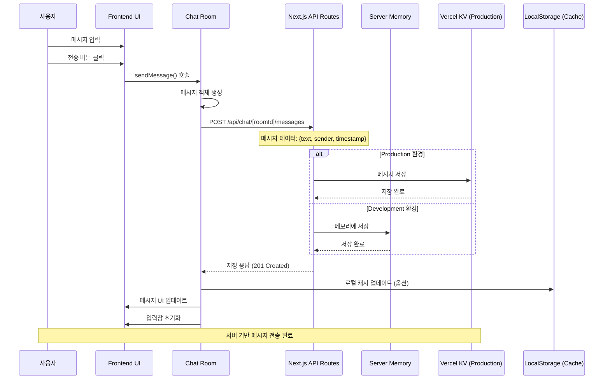
```mermaid
sequenceDiagram
    participant U as 사용자
    participant UI as Frontend UI
    participant CR as Chat Room
    participant API as Next.js API Routes
    participant MEM as Server Memory
    participant KV as Vercel KV (Production)
    participant LS as LocalStorage (Cache)

    U->>UI: 메시지 입력
    U->>UI: 전송 버튼 클릭

    UI->>CR: sendMessage() 호출
    CR->>CR: 메시지 객체 생성

    CR->>API: POST /api/chat/[roomId]/messages
    Note over API: 메시지 데이터: {text, sender, timestamp}

    alt Production 환경
        API->>KV: 메시지 저장
        KV-->>API: 저장 완료
    else Development 환경
        API->>MEM: 메모리에 저장
        MEM-->>API: 저장 완료
    end

    API-->>CR: 저장 응답 (201 Created)

    CR->>LS: 로컬 캐시 업데이트 (옵션)
    CR->>UI: 메시지 UI 업데이트
    CR->>UI: 입력창 초기화

    Note over U,KV: 서버 기반 메시지 전송 완료
```

### 실시간 메시지 폴링 흐름 (v1.0.2)

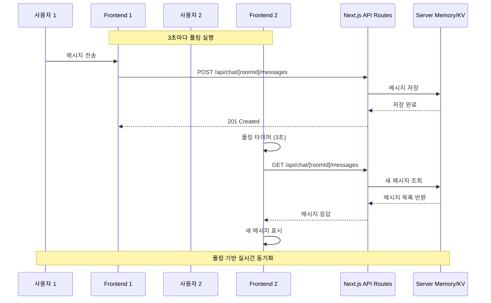
```mermaid
sequenceDiagram
    participant U1 as 사용자 1
    participant UI1 as Frontend 1
    participant U2 as 사용자 2
    participant UI2 as Frontend 2
    participant API as Next.js API Routes
    participant MEM as Server Memory/KV

    Note over UI1,UI2: 3초마다 폴링 실행

    U1->>UI1: 메시지 전송
    UI1->>API: POST /api/chat/[roomId]/messages
    API->>MEM: 메시지 저장
    MEM-->>API: 저장 완료
    API-->>UI1: 201 Created

    UI2->>UI2: 폴링 타이머 (3초)
    UI2->>API: GET /api/chat/[roomId]/messages
    API->>MEM: 새 메시지 조회
    MEM-->>API: 메시지 목록 반환
    API-->>UI2: 메시지 응답

    UI2->>UI2: 새 메시지 표시

    Note over U1,MEM: 폴링 기반 실시간 동기화
```

### 기존 LocalStorage 기반 채팅 흐름 (Legacy)

### 전송 이벤트 채팅 추가 흐름

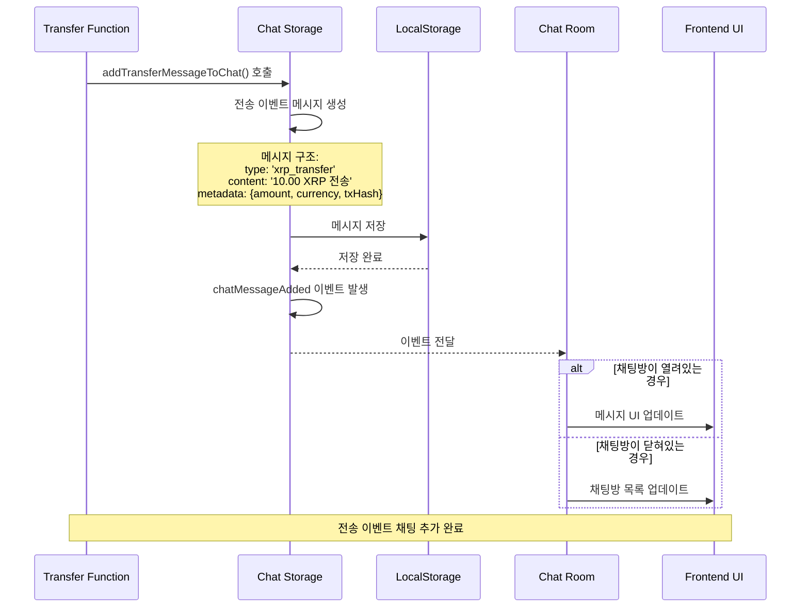
```mermaid
sequenceDiagram
    participant TF as Transfer Function
    participant CS as Chat Storage
    participant LS as LocalStorage
    participant CR as Chat Room
    participant UI as Frontend UI

    TF->>CS: addTransferMessageToChat() 호출
    CS->>CS: 전송 이벤트 메시지 생성
    
    Note over CS: 메시지 구조:<br/>type: 'xrp_transfer'<br/>content: '10.00 XRP 전송'<br/>metadata: {amount, currency, txHash}
    
    CS->>LS: 메시지 저장
    LS-->>CS: 저장 완료
    
    CS->>CS: chatMessageAdded 이벤트 발생
    CS-->>CR: 이벤트 전달
    
    alt 채팅방이 열려있는 경우
        CR->>UI: 메시지 UI 업데이트
    else 채팅방이 닫혀있는 경우
        CR->>UI: 채팅방 목록 업데이트
    end
    
    Note over TF,UI: 전송 이벤트 채팅 추가 완료
```

---

## 🔄 **스왑 흐름**

### 실제 XRPL Devnet AMM 스왑 흐름

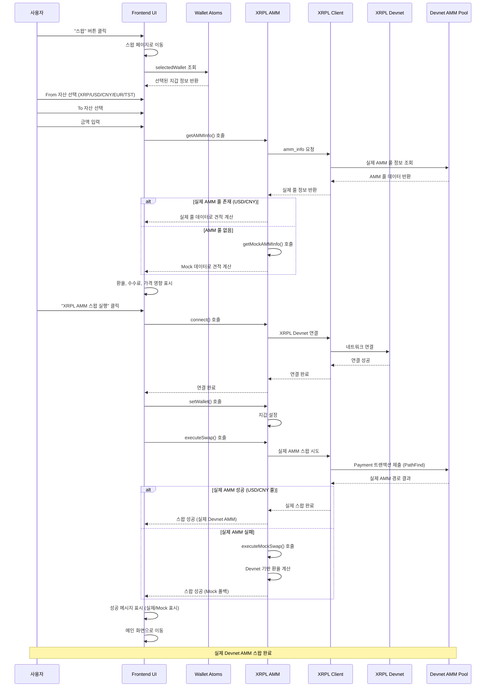
```mermaid
sequenceDiagram
    participant U as 사용자
    participant UI as Frontend UI
    participant WA as Wallet Atoms
    participant XA as XRPL AMM
    participant XC as XRPL Client
    participant XN as XRPL Devnet
    participant DP as Devnet AMM Pool

    U->>UI: "스왑" 버튼 클릭
    UI->>UI: 스왑 페이지로 이동

    UI->>WA: selectedWallet 조회
    WA-->>UI: 선택된 지갑 정보 반환

    U->>UI: From 자산 선택 (XRP/USD/CNY/EUR/TST)
    U->>UI: To 자산 선택
    U->>UI: 금액 입력

    UI->>XA: getAMMInfo() 호출
    XA->>XC: amm_info 요청
    XC->>DP: 실제 AMM 풀 정보 조회
    DP-->>XC: AMM 풀 데이터 반환
    XC-->>XA: 실제 풀 정보 반환

    alt 실제 AMM 풀 존재 (USD/CNY)
        XA-->>UI: 실제 풀 데이터로 견적 계산
    else AMM 풀 없음
        XA->>XA: getMockAMMInfo() 호출
        XA-->>UI: Mock 데이터로 견적 계산
    end

    UI->>UI: 환율, 수수료, 가격 영향 표시

    U->>UI: "XRPL AMM 스왑 실행" 클릭

    UI->>XA: connect() 호출
    XA->>XC: XRPL Devnet 연결
    XC->>XN: 네트워크 연결
    XN-->>XC: 연결 성공
    XC-->>XA: 연결 완료
    XA-->>UI: 연결 완료

    UI->>XA: setWallet() 호출
    XA->>XA: 지갑 설정

    UI->>XA: executeSwap() 호출
    XA->>XC: 실제 AMM 스왑 시도
    XC->>DP: Payment 트랜잭션 제출 (PathFind)
    DP-->>XC: 실제 AMM 경로 결과

    alt 실제 AMM 성공 (USD/CNY 풀)
        XC-->>XA: 실제 스왑 완료
        XA-->>UI: 스왑 성공 (실제 Devnet AMM)
    else 실제 AMM 실패
        XA->>XA: executeMockSwap() 호출
        XA->>XA: Devnet 기반 환율 계산
        XA-->>UI: 스왑 성공 (Mock 폴백)
    end

    UI->>UI: 성공 메시지 표시 (실제/Mock 표시)
    UI->>UI: 메인 화면으로 이동

    Note over U,DP: 실제 Devnet AMM 스왑 완료
```

### Devnet 기반 Mock 스왑 폴백 흐름

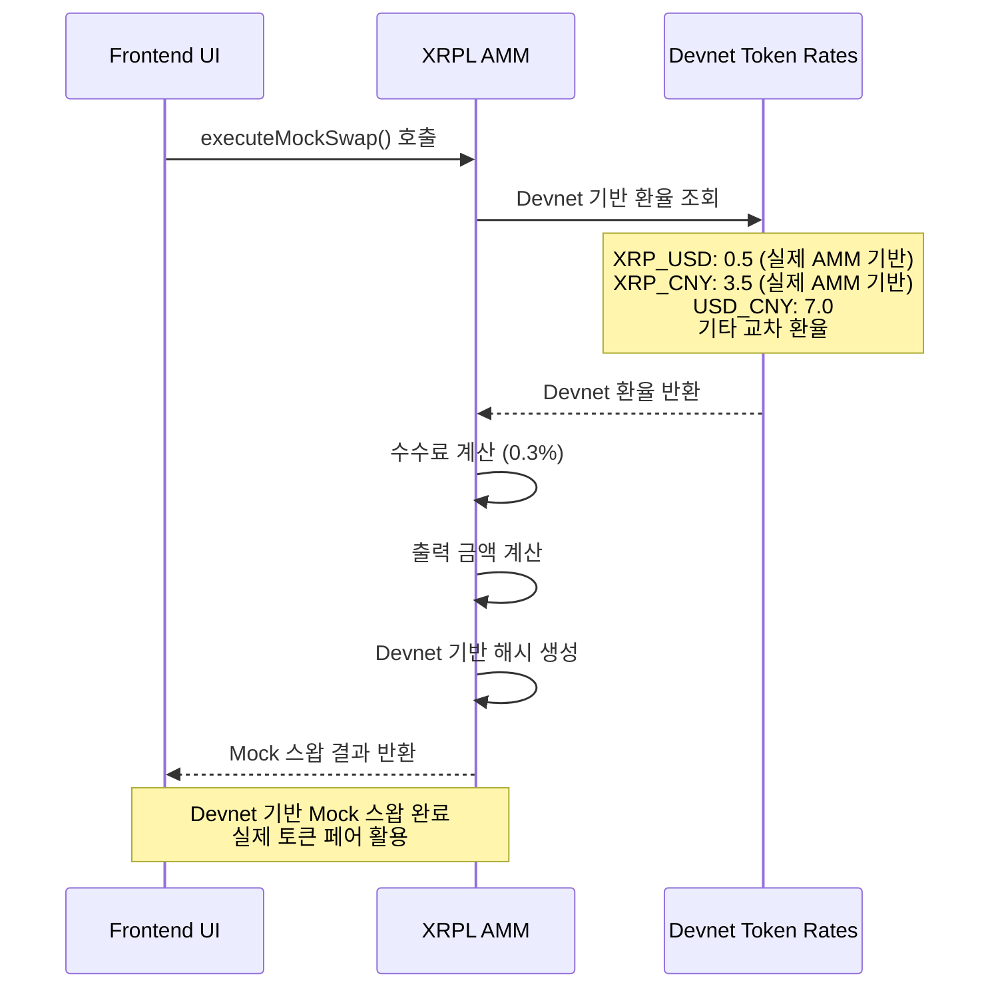
```mermaid
sequenceDiagram
    participant UI as Frontend UI
    participant XA as XRPL AMM
    participant DR as Devnet Token Rates

    UI->>XA: executeMockSwap() 호출

    XA->>DR: Devnet 기반 환율 조회

    Note over DR: XRP_USD: 0.5 (실제 AMM 기반)<br/>XRP_CNY: 3.5 (실제 AMM 기반)<br/>USD_CNY: 7.0<br/>기타 교차 환율

    DR-->>XA: Devnet 환율 반환

    XA->>XA: 수수료 계산 (0.3%)
    XA->>XA: 출력 금액 계산
    XA->>XA: Devnet 기반 해시 생성

    XA-->>UI: Mock 스왑 결과 반환

    Note over UI,XA: Devnet 기반 Mock 스왑 완료<br/>실제 토큰 페어 활용
```

---

## 🔗 **실제 Devnet Trust Line 설정 흐름**

```mermaid
sequenceDiagram
    participant U as 사용자
    participant UI as Frontend UI
    participant WA as Wallet Atoms
    participant XA as XRPL AMM
    participant XC as XRPL Client
    participant XN as XRPL Devnet
    participant DT as Devnet Token Issuers

    U->>UI: Trust Line 설정 페이지로 이동
    UI->>UI: 실제 Devnet 토큰 목록 표시

    Note over UI: USD: rJgqyVQrzRQTQREVTYK21843LR7vb7LapX<br/>CNY: rKNeAZt7zMLinPBBuopNk6uejPeARgEt5x<br/>EUR: rBXYWgAg6z5NxCshzGkNuX3YjHFyN26cgj<br/>TST: rP9jPyP5kyvFRb6ZiRghAGw5u8SGAmU4bd

    U->>UI: 토큰 선택 (USD/CNY는 실제 AMM 풀 보유)
    U->>UI: "Trust Line 설정" 클릭

    UI->>WA: selectedWallet 조회
    WA-->>UI: 선택된 지갑 정보 반환

    UI->>XA: connect() 호출
    XA->>XC: XRPL Devnet 연결
    XC->>XN: 네트워크 연결
    XN-->>XC: 연결 성공
    XC-->>XA: 연결 완료
    XA-->>UI: 연결 완료

    UI->>XA: setWallet() 호출
    XA->>XA: 지갑 설정

    UI->>XA: createTrustLine() 호출
    XA->>XC: TrustSet 트랜잭션 생성

    Note over XC,DT: 실제 Devnet 토큰 발행자로<br/>Trust Line 설정

    XC->>XN: TrustSet 트랜잭션 제출 (실제 issuer)
    XN->>DT: Trust Line 생성 요청
    DT-->>XN: Trust Line 생성 완료
    XN-->>XC: 트랜잭션 결과 반환
    XC-->>XA: Trust Line 설정 결과 반환

    alt Trust Line 설정 성공
        XA-->>UI: 설정 성공 (실제 XRPL 트랜잭션)
        UI->>UI: 실제 트랜잭션 해시 표시
        UI->>UI: XRPL Explorer 링크 제공
        UI->>UI: 자산 추가 페이지로 이동
    else Trust Line 설정 실패
        XA-->>UI: 설정 실패
        UI->>UI: 실패 메시지 표시
    end

    Note over U,DT: 실제 Devnet Trust Line 설정 완료<br/>실제 토큰 수신 준비
```

---

## 🚰 **Faucet 사용 흐름**

```mermaid
sequenceDiagram
    participant U as 사용자
    participant UI as Frontend UI
    participant WA as Wallet Atoms
    participant XF as XRPL Faucet
    participant FN as Faucet Network
    participant LS as LocalStorage

    U->>UI: "Faucet" 버튼 클릭
    
    UI->>WA: selectedWallet 조회
    WA-->>UI: 선택된 지갑 정보 반환
    
    UI->>XF: checkFaucetAvailability() 호출
    XF->>LS: 마지막 사용 시간 조회
    LS-->>XF: 사용 시간 반환
    
    alt 일일 한도 초과
        XF-->>UI: 사용 불가 응답
        UI->>UI: 한도 초과 메시지 표시
    else 사용 가능
        XF-->>UI: 사용 가능 응답
        
        UI->>XF: requestDevnetXRP() 호출
        XF->>FN: Faucet API 요청
        FN-->>XF: Faucet 응답 반환
        
        alt Faucet 성공
            XF->>LS: 사용 기록 저장
            XF-->>UI: 성공 응답
            UI->>UI: 성공 메시지 표시
            UI->>UI: 잔액 새로고침
        else Faucet 실패
            XF->>XF: getMockFaucetResponse() 호출
            XF-->>UI: Mock 응답 반환
            UI->>UI: Mock 성공 메시지 표시
        end
    end
    
    Note over U,LS: Faucet 사용 완료
```

---

## 📊 **실시간 잔액 조회 흐름**

### 초기 잔액 로드

```mermaid
sequenceDiagram
    participant UI as Frontend UI
    participant WA as Wallet Atoms
    participant WB as Wallet Balance Hook
    participant BA as Balance API
    participant XN as XRPL Network

    UI->>UI: 컴포넌트 마운트
    UI->>WA: selectedWallet 조회
    WA-->>UI: 선택된 지갑 정보 반환
    
    UI->>WB: useWalletBalance() 호출
    WB->>BA: getBalance() 호출
    BA->>XN: account_info 요청
    XN-->>BA: 계정 정보 반환
    BA->>BA: 잔액 데이터 처리
    BA-->>WB: 잔액 데이터 반환
    WB-->>UI: 잔액 데이터 반환
    
    UI->>UI: 잔액 UI 표시
    
    Note over UI,XN: 초기 잔액 로드 완료
```

### 잔액 새로고침

```mermaid
sequenceDiagram
    participant UI as Frontend UI
    participant QC as Query Client
    participant WB as Wallet Balance Hook
    participant BA as Balance API
    participant XN as XRPL Network

    UI->>QC: invalidateQueries() 호출
    QC->>WB: 쿼리 무효화
    WB->>BA: getBalance() 재호출
    BA->>XN: account_info 요청
    XN-->>BA: 최신 계정 정보 반환
    BA->>BA: 잔액 데이터 처리
    BA-->>WB: 최신 잔액 데이터 반환
    WB-->>UI: 최신 잔액 데이터 반환
    
    UI->>UI: 잔액 UI 업데이트
    
    Note over UI,XN: 잔액 새로고침 완료
```

### 전송 후 자동 새로고침

```mermaid
sequenceDiagram
    participant TF as Transfer Function
    participant UI as Frontend UI
    participant QC as Query Client
    participant WB as Wallet Balance Hook
    participant BA as Balance API
    participant XN as XRPL Network

    TF->>TF: 전송 완료
    TF->>UI: transferCompleted 이벤트 발생
    
    UI->>QC: invalidateQueries() 호출
    QC->>WB: 쿼리 무효화
    WB->>BA: getBalance() 재호출
    BA->>XN: account_info 요청
    XN-->>BA: 업데이트된 계정 정보 반환
    BA->>BA: 잔액 데이터 처리
    BA-->>WB: 업데이트된 잔액 데이터 반환
    WB-->>UI: 업데이트된 잔액 데이터 반환
    
    UI->>UI: 잔액 UI 업데이트
    
    Note over TF,XN: 전송 후 자동 새로고침 완료
```

---

## 🔄 **전체 시스템 아키텍처 흐름**

### 시스템 구성 요소 간 상호작용

```mermaid
sequenceDiagram
    participant U as 사용자
    participant UI as Frontend UI
    participant WA as Wallet Atoms
    participant XC as XRPL Client
    participant XN as XRPL Network
    participant LS as LocalStorage
    participant SR as Server Registration
    participant CS as Chat Storage

    Note over U,CS: 시스템 초기화
    U->>UI: 앱 접속
    UI->>WA: 지갑 목록 로드
    WA->>LS: 저장된 데이터 조회
    LS-->>WA: 데이터 반환
    WA-->>UI: 지갑 정보 반환
    
    Note over U,CS: 지갑 생성/복구
    U->>UI: 지갑 생성/복구 요청
    UI->>XC: 지갑 생성/복구 실행
    XC->>XN: XRPL 네트워크 연동
    XN-->>XC: 결과 반환
    XC-->>UI: 지갑 정보 반환
    UI->>WA: 지갑 정보 저장
    WA->>LS: 데이터 저장
    
    Note over U,CS: 친구 관리
    U->>UI: 친구 추가 요청
    UI->>SR: 서버 등록
    SR-->>UI: 등록 완료
    UI->>CS: 친구 정보 저장
    CS->>LS: 데이터 저장
    
    Note over U,CS: 전송 및 채팅
    U->>UI: 전송 요청
    UI->>XC: 전송 실행
    XC->>XN: 트랜잭션 제출
    XN-->>XC: 결과 반환
    XC-->>UI: 전송 완료
    UI->>CS: 채팅 이벤트 추가
    CS->>LS: 메시지 저장
    
    Note over U,CS: 시스템 운영 완료
```

---

## 📈 **성능 최적화 흐름**

### 캐싱 및 최적화

```mermaid
sequenceDiagram
    participant UI as Frontend UI
    participant QC as Query Client
    participant WB as Wallet Balance Hook
    participant BA as Balance API
    participant XN as XRPL Network
    participant Cache as React Query Cache

    UI->>WB: useWalletBalance() 호출
    WB->>QC: 쿼리 캐시 확인
    
    alt 캐시 히트
        QC-->>WB: 캐시된 데이터 반환
        WB-->>UI: 캐시된 데이터 반환
    else 캐시 미스
        WB->>BA: getBalance() 호출
        BA->>XN: 네트워크 요청
        XN-->>BA: 데이터 반환
        BA-->>WB: 데이터 반환
        WB->>QC: 캐시 저장
        QC-->>WB: 캐시 저장 완료
        WB-->>UI: 데이터 반환
    end
    
    Note over UI,Cache: 캐싱 최적화 완료
```

---

## 🎯 **요약**

### 주요 흐름 패턴

1. **사용자 액션** → **UI 처리** → **비즈니스 로직** → **데이터 저장**
2. **XRPL 연동**: 네트워크 연결 → 트랜잭션 제출 → 결과 처리
3. **상태 관리**: Atoms → LocalStorage → UI 업데이트
4. **실시간 동기화**: 이벤트 기반 → 자동 새로고침 → UI 업데이트

### 시스템 특징

- **이벤트 기반**: 전송 완료 시 채팅 자동 추가
- **실제 AMM 연동**: XRPL Devnet 실제 AMM 풀 우선 활용
- **스마트 폴백**: 실제 AMM 실패 시 Devnet 기반 Mock 스왑
- **실제 토큰**: 실제 Devnet 토큰 발행자 사용
- **캐싱**: React Query를 통한 효율적인 데이터 관리
- **실시간**: 잔액 자동 새로고침 및 상태 동기화

---

## 🆕 **v1.1 실제 AMM 연동 업그레이드**

### 주요 변경사항

#### **1. 실제 Devnet 토큰 교체**
- **기존**: Mock issuer 주소 사용
- **개선**: 실제 Devnet 토큰 발행자 사용
  - USD: `rJgqyVQrzRQTQREVTYK21843LR7vb7LapX` (실제 AMM 풀 보유)
  - CNY: `rKNeAZt7zMLinPBBuopNk6uejPeARgEt5x` (실제 AMM 풀 보유)

#### **2. 실제 AMM API 연동**
- `amm_info` 명령어로 실시간 풀 정보 조회
- 실제 유동성 및 거래 수수료 활용
- AMM 풀 없을 시 자동 Mock 폴백

#### **3. 교육적 가치 향상**
- 실제 XRPL 프로토콜 경험
- 실제 토큰 발행자와 Trust Line 학습
- 실제 AMM 경로 및 PathFind 이해

---

## 🔧 **v1.2 토큰 디스플레이 완전 해결**

### useWallet 훅 안정화 흐름

```mermaid
sequenceDiagram
    participant U as 사용자
    participant UI as Frontend UI
    participant UW as useWallet Hook
    participant WA as Wallet Atoms
    participant AC as ASSET_CONSTANTS
    parameter LS as LocalStorage
    participant EA as enabledAssets Atom

    U->>UI: 앱 접속
    UI->>UW: useWallet() 훅 초기화
    UW->>UW: console.log('🔧 useWallet hook 초기화 시작')

    UW->>WA: useAtom(walletAtom)
    UW->>WA: useAtom(walletLoadingAtom)
    UW->>EA: useAtom(enabledAssetsAtom)

    UW->>UW: 현재 상태 로깅
    UW->>UW: enabledAssets.length 확인

    alt enabledAssets가 비어있는 경우
        UW->>UW: console.log('⚡ enabledAssets 비어있음')
        UW->>AC: DEFAULT_ENABLED_ASSETS 조회
        AC-->>UW: ['XRP', 'USD', 'CNY', 'TST'] 반환
        UW->>EA: setEnabledAssets(기본값)
        UW->>UW: console.log('⚡ 설정 완료')
    else enabledAssets가 있는 경우
        UW->>UW: console.log('✅ 기존 enabledAssets 유지')
    end

    UW->>UW: getBrowserWalletId() 실행
    UW->>UW: loadWallet() 실행
    UW->>UW: loadEnabledAssets() 실행

    Note over U,EA: v1.2 안정화: enabledAssets 즉시 초기화로<br/>모든 토큰이 기본적으로 표시
```

### 브라우저별 토큰 주소 마이그레이션 흐름

```mermaid
sequenceDiagram
    participant UW as useWallet Hook
    participant LS as LocalStorage
    participant WK as Wallet Key
    participant TA as Token Addresses

    UW->>UW: loadWallet() 실행
    UW->>UW: getBrowserWalletId() 호출
    UW->>LS: 브라우저별 지갑 데이터 조회

    alt 기존 지갑 발견
        LS-->>UW: 기존 지갑 데이터 반환
        UW->>UW: 토큰 주소 존재 여부 확인

        alt 토큰 주소가 불완전한 경우
            UW->>UW: console.log('🔄 토큰 주소 추가 중...')
            UW->>TA: XRP 주소를 모든 토큰에 복사

            Note over UW,TA: addresses.USD = addresses.XRP<br/>addresses.CNY = addresses.XRP<br/>addresses.EUR = addresses.XRP<br/>addresses.TST = addresses.XRP

            UW->>TA: privateKeys 및 publicKeys 복사
            UW->>LS: 업데이트된 지갑 저장
            UW->>UW: console.log('✅ 토큰 주소 추가 완료')
        end
    else 지갑 없음
        UW->>UW: 새 브라우저별 지갑 생성
        UW->>TA: 모든 토큰에 동일한 XRPL 주소 설정
    end

    Note over UW,TA: v1.2 개선: 모든 XRPL 토큰이<br/>동일한 주소를 사용하도록 자동 마이그레이션
```

### 주요 개선사항

#### **1. useWallet 훅 안정화**
- **즉시 초기화**: enabledAssets가 비어있으면 즉시 기본값으로 설정
- **로깅 강화**: 모든 단계에서 상세한 디버깅 로그 제공
- **중복 로직 제거**: 불필요한 중복 체크 로직 정리

#### **2. 토큰 주소 자동 마이그레이션**
- **기존 지갑 호환**: 기존 XRP 전용 지갑을 토큰 지원 지갑으로 자동 업그레이드
- **주소 통합**: 모든 XRPL 토큰이 동일한 주소 사용
- **데이터 보존**: 기존 지갑 데이터와 잔액 정보 완전 보존

#### **3. 컴파일 오류 완전 해결**
- **Import 경로 수정**: 모든 import 경로 정규화
- **변수명 통일**: walletLoading 관련 변수명 일관성 유지
- **JSX 문법 수정**: 모든 JSX 문법 오류 수정

---

**🚀 v1.1 실제 AMM 연동으로 시스템 완전 업그레이드 완료!**
**✨ v1.2 토큰 디스플레이 완전 해결로 사용자 경험 최적화 완료!**