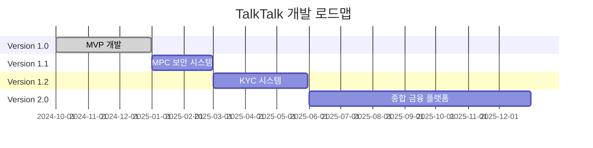

# TalkTalk 버전 로드맵

> 🚀 혁신적인 소셜 페이먼트 플랫폼의 발전 계획


## 📋 개요

TalkTalk은 XRPL 기반 메신저 및 디지털 지갑 통합 플랫폼으로, 단계별 발전을 통해 완전한 소셜 페이먼트 생태계를 구축해 나갑니다.

### 🎯 비전
- **소셜 우선**: 채팅을 중심으로 한 자연스러운 송금 경험
- **보안 강화**: 점진적인 보안 수준 향상
- **사용자 확장**: KYC를 통한 신뢰성 있는 사용자 베이스 구축
- **기능 다양화**: 다양한 금융 서비스 통합

---

## 🌟 Version 1.0 - MVP (현재 버전)

**릴리즈 날짜**: 2024년 12월
**테마**: "소셜 페이먼트의 시작"

### 🎉 핵심 기능

#### 💬 메신저 기능
- **실시간 채팅**
  - WebSocket 기반 실시간 메시징
  - 개인 및 그룹 채팅방 지원
  - 메시지 읽음 상태 표시
  - 온라인/오프라인 상태 관리

- **친구 관리**
  - 전화번호 기반 친구 검색 및 추가
  - 친구 요청 및 승인 시스템
  - 친구 목록 관리
  - 실시간 접속 상태 확인

#### 💰 지갑 기능
- **기본 지갑 관리**
  - XRPL 네이티브 지갑 생성 및 복구
  - 개인키 암호화 저장 (Redis)
  - 다중 자산 지원 (XRP + IOU 토큰)
  - 실시간 잔액 조회

- **전송 기능**
  - **일반 전송**: 1:1 즉시 송금
  - **일괄 전송**: 여러 명 동시 송금 (3가지 모드)
    - Independent: 독립 실행
    - AllOrNothing: 전체 성공/실패
    - UntilFailure: 순차 실행
  - **조건부 전송**: Escrow 기반 스마트 컨트랙트

- **자산 관리**
  - TrustLine 설정 및 관리
  - 지원 토큰 활성화/비활성화
  - 자산별 잔액 표시

#### 🔐 보안 기능
- **기본 인증**
  - SMS 기반 전화번호 인증
  - 세션 기반 로그인 관리
  - 개인키 암호화 저장

- **트랜잭션 보안**
  - XRPL 네이티브 서명
  - 트랜잭션 검증 및 확인
  - 에러 처리 및 재시도 로직

### 🏗️ 기술 스택
- **Frontend**: Next.js 15.3.3, React 18, TypeScript, Tailwind CSS
- **Backend**: Node.js, Redis
- **Blockchain**: XRPL v4.3.0
- **Real-time**: WebSocket

### 📊 현재 성과 지표
- ✅ 실시간 채팅 및 송금 통합
- ✅ XRPL 표준 트랜잭션 패턴 구현
- ✅ 친화적인 사용자 인터페이스
- ✅ 안정적인 WebSocket 연결
- ✅ 다중 전송 모드 지원

---

## 🔒 Version 1.1 - 보안 강화

**예상 릴리즈**: 2025년 2월
**테마**: "엔터프라이즈급 보안"

### 🛡️ 주요 추가 기능

#### 🔐 MPC (Multi-Party Computation) 보안
- **분산 키 관리**
  - 개인키를 여러 파티로 분산 저장
  - Redis 단일 지점 실패 제거
  - 키 복구 시 다중 서명 필요

- **MPC 지갑 구조**
  ```
  사용자 디바이스 (33%) + 서버 A (33%) + 서버 B (33%) + 복구 키 (1%)
  ```

- **향상된 보안 모델**
  - 2-of-3 임계값 서명
  - 하드웨어 보안 모듈 (HSM) 통합
  - 키 회전 및 백업 자동화

#### 🔒 고급 인증 시스템
- **다단계 인증 (MFA)**
  - SMS + 앱 기반 TOTP
  - 생체 인증 지원 (지문, 얼굴)
  - 백업 복구 코드

- **세션 보안 강화**
  - JWT 토큰 기반 인증
  - 세션 만료 및 갱신
  - 디바이스 등록 및 관리

#### 📱 보안 모니터링
- **실시간 위험 탐지**
  - 비정상적인 로그인 패턴 감지
  - 고액 거래 알림 시스템
  - IP 기반 지역 제한

- **감사 로깅**
  - 모든 보안 이벤트 로깅
  - 블록체인 트랜잭션 추적
  - 컴플라이언스 리포팅

### 🏗️ 기술 업그레이드
- **MPC 라이브러리**: TSS (Threshold Signature Scheme)
- **보안 저장소**: HashiCorp Vault
- **모니터링**: Grafana + Prometheus
- **암호화**: AES-256-GCM, ECDSA

### 📈 예상 성과
- 🔒 보안 등급 AAA+ 달성
- 🏢 기업 고객 대상 서비스 확장
- 🛡️ 해킹 위험 99.9% 감소
- 📊 감사 추적성 100% 확보

---

## 📱 Version 1.2 - 신원 인증 및 규제 준수

**예상 릴리즈**: 2025년 5월
**테마**: "신뢰할 수 있는 플랫폼"

### 🆔 KYC (Know Your Customer) 시스템

#### 📋 신원 확인 프로세스
- **1단계: 기본 정보**
  - 실명 입력 및 검증
  - 생년월일, 주소 확인
  - 이메일 주소 인증

- **2단계: 신분증 인증**
  - 주민등록증/운전면허증 촬영
  - OCR 기반 자동 정보 추출
  - AI 기반 위변조 검증

- **3단계: 본인 확인**
  - 얼굴 인식 및 신분증 대조
  - 라이브니스 검사 (실시간 촬영)
  - 음성 인증 (선택적)

#### 📞 고도화된 전화번호 인증
- **통신사 연동 인증**
  - SKT, KT, LG U+ 직접 연동
  - 실명과 전화번호 매칭 확인
  - 선불폰 및 가상번호 차단

- **다중 채널 인증**
  - SMS + 음성 통화 인증
  - 푸시 알림 기반 인증
  - 하이브리드 인증 방식

#### 🏛️ 규제 준수 시스템
- **AML (자금세탁방지)**
  - 거래 패턴 모니터링
  - 의심 거래 자동 탐지
  - 당국 보고 시스템

- **거래 한도 관리**
  - KYC 등급별 차등 한도
  - 일일/월간 송금 한도
  - 고액 거래 추가 인증

### 🔒 고급 보안 기능

#### 🛡️ 실시간 위험 평가
- **거래 위험도 점수**
  - 사용자 행동 패턴 분석
  - 수신자 신뢰도 평가
  - 금액 및 빈도 기반 위험도

- **적응형 인증**
  - 위험도에 따른 인증 단계 조정
  - 저위험: 생체 인증
  - 고위험: 다단계 인증 + 승인 대기

#### 📊 컴플라이언스 대시보드
- **관리자 도구**
  - KYC 승인/거부 관리
  - 의심 거래 검토 및 처리
  - 규제 리포트 생성

- **사용자 신뢰도 관리**
  - 신뢰도 점수 시스템
  - 거래 이력 기반 등급 상향
  - 커뮤니티 평판 시스템

### 🏗️ 인프라 강화
- **KYC 서비스**: Jumio, Onfido 연동
- **통신사 API**: PASS, 본인인증 서비스
- **AI 엔진**: TensorFlow, 얼굴 인식
- **컴플라이언스**: Chainalysis, Elliptic

### 📈 예상 성과
- 🆔 실명 인증률 98% 달성
- 🏛️ 금융당국 라이센스 획득
- 📊 규제 준수 100% 달성
- 🤝 제휴사 확장 (은행, 핀테크)

---

## 🚀 Version 2.0 - 종합 금융 플랫폼

**예상 릴리즈**: 2025년 12월
**테마**: "소셜 페이먼트를 넘어서"

### 🌐 확장된 생태계

#### 💳 디지털 카드 서비스
- **가상 체크카드**
  - 즉시 발급 가능한 디지털 카드
  - 오프라인 매장 결제 지원
  - Apple Pay, Google Pay 연동

- **암호화폐 직불카드**
  - XRP 잔액으로 직접 결제
  - 실시간 환율 적용
  - 글로벌 사용 가능

#### 🏪 커머스 통합
- **소셜 커머스**
  - 채팅 중 상품 주문 및 결제
  - 그룹 공동구매 기능
  - 친구 추천 시스템

- **P2P 마켓플레이스**
  - 개인 간 상품 거래
  - 에스크로 결제 시스템
  - 평점 및 리뷰 시스템

#### 💰 투자 및 자산 관리
- **암호화폐 포트폴리오**
  - 다중 체인 지원 (Bitcoin, Ethereum)
  - 자동 리밸런싱
  - DeFi 프로토콜 연동

- **저축 및 대출**
  - 고수익 저축 상품
  - P2P 대출 플랫폼
  - 스테이킹 서비스

### 🤖 AI 기반 개인화

#### 🧠 지능형 어시스턴트
- **스마트 송금 추천**
  - 소비 패턴 분석
  - 최적 송금 타이밍 제안
  - 수수료 최적화

- **재정 관리 조언**
  - 개인 맞춤 예산 관리
  - 투자 포트폴리오 추천
  - 위험 관리 가이드

#### 📊 예측 분석
- **시장 분석**
  - 암호화폐 가격 예측
  - 트렌드 분석 및 알림
  - 투자 기회 발견

- **사용자 행동 예측**
  - 송금 패턴 분석
  - 사기 거래 사전 탐지
  - 개인화된 서비스 제공

### 🌍 글로벌 확장

#### 🌐 다국가 서비스
- **다중 언어 지원**
  - 10개 언어 완전 지원
  - 실시간 번역 기능
  - 지역별 맞춤 UI/UX

- **현지 규제 준수**
  - 국가별 KYC 요구사항
  - 현지 금융 라이센스
  - 세무 신고 지원

#### 🤝 파트너십 확장
- **금융기관 연동**
  - 은행 계좌 직접 연결
  - 신용카드 결제 지원
  - 대출 서비스 연동

- **기업 서비스**
  - B2B 결제 솔루션
  - 급여 지급 시스템
  - 기업 자금 관리

### 🛡️ 차세대 보안

#### 🔐 양자 저항 암호화
- **포스트 양자 암호**
  - NIST 표준 양자 저항 알고리즘
  - 미래 양자 컴퓨터 대비
  - 점진적 마이그레이션

#### 🌐 분산 아키텍처
- **멀티 클라우드**
  - AWS, Azure, GCP 분산
  - 지역별 데이터 센터
  - 무중단 서비스 보장

### 🏗️ 기술 혁신
- **AI/ML**: GPT-4, Claude, 자체 모델
- **블록체인**: Multi-chain 지원
- **인프라**: Kubernetes, Microservices
- **데이터**: BigQuery, Elasticsearch

### 📈 목표 지표
- 👥 사용자 1,000만 명 달성
- 💰 일일 거래량 100억 원
- 🌍 20개국 서비스 확장
- 🏆 글로벌 핀테크 Top 10

---

## 📅 마일스톤 타임라인



## 🎯 핵심 성공 지표 (KPI)

### Version 1.0 (현재)
- ✅ **DAU**: 1,000명
- ✅ **거래 성공률**: 99.5%
- ✅ **평균 응답시간**: <2초
- ✅ **사용자 만족도**: 4.2/5.0

### Version 1.1 목표
- 🎯 **보안 등급**: AAA+
- 🎯 **해킹 시도 차단율**: 99.9%
- 🎯 **키 복구 성공률**: 100%
- 🎯 **기업 고객**: 50개사

### Version 1.2 목표
- 🎯 **KYC 완료율**: 95%
- 🎯 **실명 인증률**: 98%
- 🎯 **컴플라이언스 준수**: 100%
- 🎯 **규제 승인**: 금융당국 라이센스

### Version 2.0 목표
- 🎯 **사용자 수**: 1,000만 명
- 🎯 **일일 거래량**: 100억 원
- 🎯 **글로벌 확장**: 20개국
- 🎯 **시장 점유율**: 국내 Top 3

---

## 🚨 위험 요소 및 대응책

### 기술적 위험
- **블록체인 네트워크 불안정**
  - 대응: 다중 네트워크 지원, 장애 조치
- **확장성 문제**
  - 대응: 마이크로서비스 아키텍처, 캐싱

### 규제적 위험
- **암호화폐 규제 변화**
  - 대응: 법무팀 확대, 로비 활동
- **KYC/AML 요구사항 강화**
  - 대응: 선제적 컴플라이언스 구축

### 경쟁적 위험
- **대형 플랫폼 진입**
  - 대응: 차별화된 UX, 커뮤니티 강화
- **기술 격차**
  - 대응: R&D 투자 확대, 인재 영입

---

## 💡 혁신 방향

### 사용자 경험
- **대화형 UI**: 자연어 기반 금융 서비스
- **AR/VR 통합**: 몰입형 소셜 페이먼트
- **IoT 연동**: 스마트 기기와의 자동 결제

### 기술 혁신
- **엣지 컴퓨팅**: 지연 시간 최소화
- **5G 최적화**: 초고속 실시간 거래
- **블록체인 상호 운용성**: 크로스체인 브리지

### 비즈니스 모델
- **수수료 최적화**: 동적 수수료 모델
- **토큰 이코노미**: 자체 토큰 생태계
- **DeFi 통합**: 탈중앙화 금융 서비스

---

**TalkTalk과 함께 금융의 미래를 만들어가세요! 🚀**

> 매 버전마다 더 안전하고, 더 편리하고, 더 혁신적인 경험을 제공합니다.